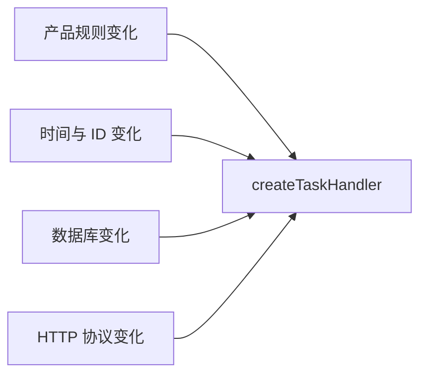
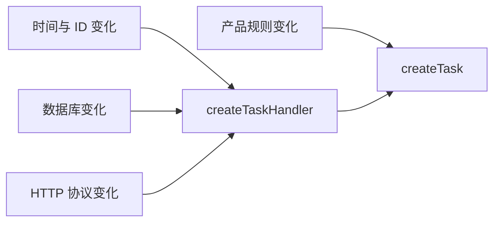

# 第一章：软件架构首先管理变化

## 先看一个现实中常见的处理函数

假设我们正在编写任务管理 API。用户提交一个标题，程序创建任务并保存：

下面是从完整后端中截取的教学片段。它假定项目已经提供 `database.insert()`，并从 Node.js 内置模块导入 `randomUUID()`；这里暂时省略数据库实现和 HTTP 框架接线，只观察这个函数承担了哪些工作。

```ts
import { randomUUID } from "node:crypto";

async function createTaskHandler(body: { title?: string }) {
  const title = body.title?.trim();

  if (!title) {
    throw new Error("任务标题不能为空");
  }

  const task = {
    id: randomUUID(),
    title,
    status: "todo",
    createdAt: new Date().toISOString(),
  };

  await database.insert("tasks", task);

  return { statusCode: 201, body: task };
}
```

这段代码没有明显的语法问题。对于刚开始的项目，它甚至可能是最合理的第一版。

但我们先不讨论怎样重构，而是问一个更重要的问题：

> 哪些变化会迫使这个函数修改？

可能的答案包括：

- 产品允许创建任务时不填写标题；
- 任务增加优先级和截止时间；
- ID 不再使用 UUID，而由数据库生成；
- 时间需要使用用户所在时区；
- 数据库从 SQLite 换成 PostgreSQL；
- HTTP 成功状态码或返回格式改变；
- 保存失败时需要返回统一错误结构；
- 创建任务后需要记录审计日志。

这些变化并不是同一种变化。产品规则、时间来源、ID 生成、数据库和 HTTP 协议由不同原因推动，却都集中在一个函数里。

## 架构关心的不是代码长短

一个二十行函数不一定需要拆分，一个五行函数也不一定设计良好。真正值得观察的是：

> 原本互不相关的变化，是否被迫修改同一块代码？

如果数据库变化和任务标题规则变化总是要碰同一个函数，我们就很难判断一次修改只影响哪里。测试也会变麻烦：为了验证“标题不能为空”，可能不得不准备数据库；为了测试数据库失败，又会经过标题校验、时间生成和 HTTP 返回逻辑。

软件设计中，一块代码承担的工作以及它需要维护的规则，可以称为它的**职责（responsibility）**。初学时可以先把职责理解成“这块代码对哪一种变化负责”。这个解释不是严格公式，但非常适合用来发现混在一起的问题。

这里的函数至少认识：

```text
输入数据
业务规则
ID 生成方式
系统时间
数据库
HTTP 返回格式
```

一个模块认识的外部细节越多，这些细节变化时，它越容易被牵着一起修改。模块之间这种互相牵连的程度叫作**耦合（coupling）**。耦合不是“有依赖就是坏事”，而是提醒我们观察依赖是否过多、过具体，以及变化是否会沿依赖传播。

## 边界是让变化停下来的地方

假设数据库由 SQLite 换成 PostgreSQL。理想情况下，任务“标题不能为空”的规则不应该跟着改变。反过来，产品允许空标题时，数据库连接代码也不应该被重新理解和测试。

我们希望在两类工作之间划一条线：

```text
创建一个合法任务           把任务保存到某种数据库
```

这条控制接触方式的线叫作**边界（boundary）**。边界不一定是文件夹、类或接口。它首先是一项设计决定：哪些知识属于这一边，另一边只通过什么信息与它协作。

好的边界像防火门。它不能阻止变化发生，但能减少变化继续蔓延到无关区域。

## 先做一个最小改进

现在只把“怎样创建一个合法任务”提取成普通函数：

```ts
interface Task {
  readonly id: string;
  readonly title: string;
  readonly status: "todo";
  readonly createdAt: string;
}

function createTask(
  titleInput: string | undefined,
  id: string,
  createdAt: string,
): Task {
  const title = titleInput?.trim();

  if (!title) {
    throw new Error("任务标题不能为空");
  }

  return { id, title, status: "todo", createdAt };
}
```

原来的处理函数可以负责协调外部工作：

下面仍然是同一个后端中的片段，继续使用项目提供的 `database` 和前面导入的 `randomUUID()`。它用于对比职责变化，不是一个可以单独复制运行的完整文件。

```ts
async function createTaskHandler(body: { title?: string }) {
  const task = createTask(
    body.title,
    randomUUID(),
    new Date().toISOString(),
  );

  await database.insert("tasks", task);
  return { statusCode: 201, body: task };
}
```

我们没有创建五层目录，也没有引入 Repository、Controller、Service、Factory 或依赖注入容器。当前只建立了一条小边界：

```text
createTask       只知道创建任务的规则
handler          知道时间、ID、数据库和 HTTP
```

这还不是最终结构。处理函数依旧承担多个外部职责，后面会继续演进。但现在已经得到一个直接收益：任务规则可以不连接数据库就测试。

```ts
import assert from "node:assert/strict";

const task = createTask(
  "  学习架构  ",
  "task-001",
  "2026-08-23T00:00:00.000Z",
);

assert.deepEqual(task, {
  id: "task-001",
  title: "学习架构",
  status: "todo",
  createdAt: "2026-08-23T00:00:00.000Z",
});
```

`createTask` 在相同输入下会得到相同结果，而且不读取数据库、网络或系统时间。这样的函数通常称为**纯函数（pure function）**：它的结果由输入决定，执行时不修改外部环境。纯函数更容易测试，但不是所有代码都应该变成纯函数；保存数据库本来就是需要改变外部状态的工作。

## 为什么把 ID 和时间传进来

如果 `createTask` 内部直接调用 `crypto.randomUUID()` 和 `new Date()`，每次测试得到的结果都不同。我们仍然可以用其他方式测试，但验证会更麻烦。

把 ID 和时间作为输入，不是因为函数参数越多越好，而是因为：

- ID 生成策略可能变化；
- 时间来自运行环境；
- 它们不是“标题是否有效”这条业务规则的一部分；
- 测试可以明确提供固定值。

这里已经出现了架构设计中非常重要的动作：把不稳定的外部信息留在边缘，把容易验证的规则放在内部。

## 什么时候不需要这样拆

如果这只是一个运行一次的数据迁移脚本，规则稳定、没有测试要求，也不会继续维护，那么把所有步骤顺序写在一起可能更清楚。

拆分会增加阅读跳转和命名成本。如果提取后的函数没有独立规则、不会单独变化、也没有测试价值，那么它可能只是把一段简单代码搬到了另一个文件。

判断是否拆分时，不要问：

> 一个函数超过多少行必须拆？

应该问：

> 这里是否混合了由不同原因推动的变化？把它们分开后，修改和验证是否更局部？

## 常见误区

### 误区一：文件越多，架构越好

如果把原函数机械地拆成 `TaskService`、`TaskManager`、`TaskHelper` 和 `TaskUtils`，但它们仍然互相知道所有细节，变化依旧会到处传播。文件数量增加了，边界却没有变清楚。

### 误区二：一开始就套用完整架构模板

六边形架构或 Clean Architecture 可以帮助大型系统控制依赖，但当前案例还没有证明需要完整层次。我们会随着数据库、HTTP 和测试问题真实出现，再逐步引入相应结构。

### 误区三：只要使用接口就解耦了

接口可以形成边界，也可以只是多写一个文件。如果接口仍然泄露具体数据库概念，或者只有一个简单实现且没有测试和替换价值，它未必减少复杂度。

## 再用一张图理解

原来的函数把多种变化放在同一个修改点：



最小改进后，任务规则有了自己的边界：



这张图没有表示系统已经设计完成。它只说明产品规则不再和数据库代码挤在同一个修改点。

## 请用自己的话解释

不要使用“职责”“耦合”“边界”“纯函数”这几个词，回答下面的问题：

> 为什么把 `createTask` 从 HTTP 处理函数中提取出来，可能让以后修改标题规则更安全？

如果你只能回答“因为这样更解耦”，说明目前记住了术语，但还没有解释现象。试着说清楚哪些代码不再需要参与修改和测试。

## 练习一：列出变化原因

观察下面的函数：

这是用于分析职责的伪代码。假定 `findTask()` 一定返回任务，任务允许写入 `completedAt`，并且数据库、邮件和日志对象已经由应用提供。真实系统还必须处理“任务不存在”和外部调用失败，这些内容会在错误处理章节展开。

```ts
async function completeTask(taskId: string) {
  const task = await database.findTask(taskId);
  task.status = "done";
  task.completedAt = new Date().toISOString();
  await database.saveTask(task);
  await email.send("任务已经完成");
  console.log(`completed task: ${taskId}`);
}
```

请列出至少四种可能迫使它修改的变化，并判断这些变化是否来自同一个原因。

## 练习二：只做最小拆分

不要引入类和设计模式。尝试提取一个普通函数，专门表达“任务在什么条件下可以完成，以及完成后状态如何变化”。数据库、邮件和日志暂时留在外部。

完成后回答：

1. 新函数是否可以不连接数据库进行测试？
2. 邮件文案变化时，新函数是否需要修改？
3. 如果答案仍然是需要，哪种知识可能还混在一起？

## 本章小结

软件架构的起点不是选择模式，而是观察变化：

- 哪些变化会迫使代码修改；
- 这些变化是否来自不同原因；
- 修改影响会不会传播到无关工作；
- 能否建立一个小边界，让变化停在更局部的位置；
- 新增边界的成本是否值得。

下一章会继续回答：怎样判断一组代码是否属于同一个职责，以及依赖方向为什么会决定变化向哪里传播。
