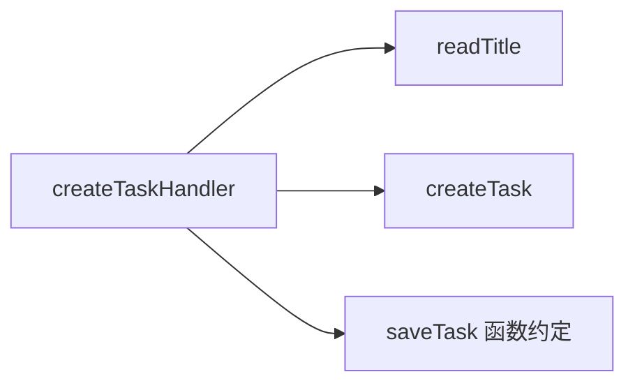

# 第二章：职责、依赖、耦合与内聚

## 文件已经拆开，问题就解决了吗

第一章把任务创建规则提取成了 `createTask()`。现在假设我们继续整理目录，把保存逻辑也放进单独文件：

```ts
// create-task.ts
import { randomUUID } from "node:crypto";
import { insertTask } from "./sqlite-task-store.js";
import type { Task } from "./task.js";

export async function createTask(
  titleInput: string | undefined,
): Promise<Task> {
  const title = titleInput?.trim();
  if (!title) throw new Error("任务标题不能为空");

  const task: Task = {
    id: randomUUID(),
    title,
    status: "todo",
    createdAt: new Date().toISOString(),
  };

  await insertTask(task);
  return task;
}
```

现在至少有三个文件：

```text
task.ts
create-task.ts
sqlite-task-store.ts
```

看起来比一个大文件更整齐。但如果数据库从 SQLite 换成 PostgreSQL，`create-task.ts` 仍然可能需要修改，因为它直接认识 `sqlite-task-store.ts`。为了测试“标题不能为空”，测试也可能被迫准备数据库环境。

代码位置分开了，变化却没有真正分开。

这就是本章要回答的问题：

> 怎样判断两个模块是真的各自负责一类工作，还是只把原来的混合代码搬到了不同文件？

## 职责不是“一个函数只能做一步”

在第一章里，我们暂时把**职责（responsibility）**理解成“这块代码对哪一类变化负责”。现在把这个解释再推进一步：

> 职责是一组应该由同一个所有者维护的知识和决定。

创建任务时可能需要做三步：

```text
清理标题两端空格
拒绝空标题
把初始状态设为 todo
```

虽然有三个步骤，但它们都在回答同一个问题：怎样得到一个合法的新任务？把它们放进 `createTask()`，并不违反“职责单一”。

相反，下面两件事看起来都只是“一行代码”，却属于不同职责：

```text
标题不能为空              产品业务规则
使用 SQLite 的 INSERT     数据库存储细节
```

判断职责时，不要数代码行，也不要数函数调用。应该问：谁会要求这条规则变化？变化时需要理解哪一类知识？

## 依赖就是“完成工作前必须知道什么”

`create-task.ts` 想保存任务，因此 import 了 `insertTask`：

```ts
import { insertTask } from "./sqlite-task-store.js";
```

这表示 `create-task.ts` 必须知道另一个模块提供什么名字、怎样调用，以及对方接受什么数据。软件设计中，这种“一个模块必须知道或使用另一个东西才能完成工作”的关系叫作**依赖（dependency）**。

依赖可以表现为很多形式：

- import 一个函数或类型；
- 调用另一个对象的方法；
- 接受某种参数或返回某种结果；
- 遵守数据库表结构、HTTP JSON 结构或事件格式；
- 读取某个环境变量或全局单例。

依赖本身不是错误。一个完全没有依赖的模块几乎做不了任何有用工作。真正需要观察的是：依赖指向哪里，以及对方变化时会牵连多少代码。

## 依赖方向决定谁知道谁

在反例中，源码关系是：

```text
create-task.ts  ──知道──>  sqlite-task-store.ts
```

箭头从“必须知道别人”的模块指向“被别人知道”的模块。这个箭头就是**依赖方向（dependency direction）**。

它和业务数据的流动方向不是一回事。任务数据可能从 `createTask()` 传给数据库，但判断依赖方向时，我们看的是：哪个源码模块 import、调用或遵守了哪个模块的约定。

为什么方向重要？因为变化通常会沿着“知道对方”的一侧传播。

如果 `create-task.ts` 知道 SQLite 的函数名、错误类型和表结构，那么 SQLite 适配发生变化时，任务规则模块也可能被迫重新理解、修改和测试。

我们的目标不是让所有箭头消失，而是让容易独立变化的技术细节不要渗进任务规则。

## 耦合不是 import 数量

假设两个模块都只有一个 import：

```ts
import type { Task } from "./task.js";
```

和：

```ts
import { sqliteConnection } from "./database.js";
```

虽然 import 数量相同，带来的影响可能完全不同。

第一个模块只认识任务数据的公开形状。如果这个形状稳定，修改影响可能很小。第二个模块直接认识数据库连接、SQL 方言、事务方式和错误对象，数据库实现变化时更容易被牵连。

一个模块变化时，另一个模块被迫理解、修改或重新验证的程度叫作**耦合（coupling）**。因此，耦合不能只靠“依赖数量”判断，还要看模块知道了对方多少细节，以及这些细节是否经常变化。

可以用下面几个问题观察耦合：

1. 对方修改内部实现时，我是否也要修改？
2. 测试我自己的规则时，是否必须启动对方？
3. 对方的错误类型、配置和生命周期是否泄露到我这里？
4. 一个需求变化会不会迫使多个无关模块一起重新验证？

低耦合不是“谁也不认识谁”，而是模块只知道完成协作真正需要的部分。

## 内聚是在问“这些知识为什么待在一起”

现在看两个假想模块。

第一个模块包含：

```text
Task 类型
创建任务规则
重命名任务规则
完成任务规则
```

这些内容都围绕任务状态和任务规则变化。它们放在同一个任务领域模块中，读者容易预测新规则应该去哪里。

第二个模块叫 `helpers.ts`，包含：

```text
清理任务标题
拼接数据库连接字符串
格式化 HTTP 错误
发送完成邮件
读取环境变量
```

这些函数可能都很短，也都可以复用，但它们没有共同的业务主题。标题规则、数据库配置、HTTP 协议、邮件和环境变量由不同原因变化，却被装进了一个“杂物箱”。

一个模块内部的代码是否围绕清晰、相关的知识和变化原因组织，叫作**内聚（cohesion）**。内容越能共同回答同一类问题，通常内聚越高。

高内聚不是“代码只要放在同一个文件里”。如果不同职责只是物理上靠在一起，仍然是低内聚。反过来，一个任务模块包含多个函数也不一定职责混乱，只要这些函数共同维护任务规则。

## 五个概念放在一起看

| 概念 | 先用人话理解 | 常见误解 |
| --- | --- | --- |
| 职责 | 这块代码拥有哪一类知识和决定 | 一个函数只能执行一步 |
| 依赖 | 完成工作前必须知道或使用什么 | 有依赖就是坏设计 |
| 依赖方向 | 谁知道谁、谁调用谁 | 等同于数据流向 |
| 耦合 | 一处变化会牵连另一处到什么程度 | import 越少耦合越低 |
| 内聚 | 放在一起的内容是否共同解决一类问题 | 同一个文件就是高内聚 |

它们不是五条互不相关的定义。我们真正关心的是一条连续的判断：

```text
一类变化应该由谁负责
→ 它完成工作需要依赖谁
→ 依赖箭头指向哪里
→ 对方变化会牵连它多少
→ 它内部的内容是否仍围绕同一类知识
```

## 做一个最小改进

这次只建立三个小边界：外部输入形状、任务业务规则和外部协调。

为让后面的片段类型完整，继续使用第一章中的最小任务类型：

```ts
interface Task {
  readonly id: string;
  readonly title: string;
  readonly status: "todo";
  readonly createdAt: string;
}
```

### 第一步：只确认外部输入的形状

HTTP 请求在运行时可能传来 `null`、数字、数组或任意 JSON。TypeScript 的类型标注不会自动检查网络数据，因此入口先接收 `unknown`：

```ts
function readTitle(input: unknown): string | undefined {
  if (
    typeof input !== "object" ||
    input === null ||
    !("title" in input)
  ) {
    return undefined;
  }

  return typeof input.title === "string"
    ? input.title
    : undefined;
}
```

`readTitle()` 只回答“外部数据里有没有字符串标题”。它不决定空标题是否允许，也不负责保存任务。

### 第二步：任务规则只创建合法任务

沿用第一章的业务函数：

```ts
function createTask(
  titleInput: string | undefined,
  id: string,
  createdAt: string,
): Task {
  const title = titleInput?.trim();
  if (!title) throw new Error("任务标题不能为空");

  return { id, title, status: "todo", createdAt };
}
```

这里“必须是字符串”属于外部输入形状，“不能为空”属于任务业务规则。它们现在由不同边界拥有。

### 第三步：处理函数负责协调

处理函数接收一个类型明确的 `saveTask(task: Task)` 函数。调用者可以把真实 SQLite 保存函数传进来；数据库内部如何实现仍被省略，这一章只观察调用关系。

```ts
import { randomUUID } from "node:crypto";

async function createTaskHandler(
  input: unknown,
  saveTask: (task: Task) => Promise<void>,
): Promise<Task> {
  const task = createTask(
    readTitle(input),
    randomUUID(),
    new Date().toISOString(),
  );

  await saveTask(task);
  return task;
}
```

处理函数现在确实依赖多个模块，但这不自动表示设计很差。它的职责就是组织一次用例：读取输入、创建任务、保存结果。协调者知道参与步骤是正常的，关键是任务规则不再知道数据库和 HTTP 输入细节。

`saveTask` 只是一个窄的函数参数，不是 Repository 类或依赖注入容器。当前还没有出现多个持久化操作、复杂查询或事务边界；等这些问题真实出现时，再判断是否值得把保存能力正式组织成 Repository。

## 变化现在会停在哪里

考虑三种变化：

### HTTP 字段从 `title` 改成 `taskTitle`

主要修改 `readTitle()`。任务规则仍然接收一个可能缺失的字符串，不需要知道 HTTP 字段名称。

### 产品允许标题最大 100 个字符

主要修改 `createTask()`。数据库保存函数和 HTTP JSON 读取方式不需要理解长度规则。

### SQLite 的插入语句发生变化

主要修改调用者提供的 SQLite 保存函数。`createTask()` 不认识表名、SQL 或数据库连接，因此不应修改。

这就是边界是否有效的一个检查方法：列出不同变化，再看每种变化是否停在负责它的区域。

## 再用依赖图理解

反例让任务规则直接依赖数据库实现：


最小改进把协调放在外侧：



图中的箭头表示源码中的知道、调用或 import 关系。请求数据的实际流动路径可能也是从 handler 到各步骤，但两者概念不能混为一谈。

现在产品规则变化不会沿箭头迫使 `createTask()` 去理解 SQLite。外部协调者依赖内部规则，而内部规则不依赖外部技术实现。这种方向会在后面的依赖倒置和六边形架构中继续出现，但目前不需要先记那些名称。

## 什么时候不需要继续拆

如果 `readTitle()` 只在一个五行脚本中使用，输入结构固定，也不存在业务规则，那么单独提取函数可能只增加跳转。

如果保存任务永远只是一个简单调用，测试也可以使用真实数据库快速完成，那么现在创建 `TaskRepository` 接口和依赖注入容器可能没有收益。

是否继续拆分，仍然要回答：

```text
哪一种变化正在制造成本？
新的边界把它限制在哪里？
新增间接性是否比原问题更容易理解？
```

没有具体变化和验证需求时，保持直接调用通常更诚实。

## 常见误区

### 误区一：一个文件只能有一个函数

“单一职责”不是按函数数量判断。几个函数如果共同维护任务状态规则，放在同一个任务模块中可能比散落在多个目录更容易理解。

### 误区二：依赖越少越好

为了完成创建任务，用例必然依赖任务规则和保存能力。问题不是依赖存在，而是是否依赖了不必要、过于具体或经常独立变化的细节。

### 误区三：所有东西都要有接口

接口适合表达稳定协作约定、提供测试接缝或隔离多个实现。只为了让目录看起来像企业架构而给每个函数配一个接口，会增加命名、跳转和维护成本。

### 误区四：TypeScript 类型就是运行时校验

把 HTTP body 写成 `{ title?: string }` 只改变编译器的理解，不会阻止客户端发送数字或 `null`。网络、文件、数据库和环境变量中的数据进入程序时，仍然需要运行时检查。

### 误区五：`readonly` 代表对象永远不会改变

`readonly` 主要限制 TypeScript 代码通过该属性直接赋值。它不是数据库约束，也不会自动冻结运行时对象。类型表达的是代码约定的一部分，不等于完整的运行时保护。

## 请用自己的话解释

不要使用“职责”“依赖”“耦合”“内聚”这四个词，回答：

> 为什么把任务规则、HTTP 输入读取和数据库保存放在不同边界后，更换数据库时不应该修改标题校验代码？

一个合格回答应该说出：每块代码知道什么，以及数据库变化不再需要哪些代码参与理解和验证。

## 练习一：画出知道关系

下面是用于分析的伪代码，省略了任务不存在和外部调用失败。这个练习假定任务状态类型包含 `"todo" | "done"`，并允许 `completedAt`；它独立于前文只描述“新建任务”的最小 `Task` 类型。

```ts
async function completeTaskHandler(taskId: string) {
  const task = await database.findTask(taskId);
  task.status = "done";
  task.completedAt = new Date().toISOString();
  await database.saveTask(task);
  await email.sendTaskCompleted(task);
}
```

请完成：

1. 写出这个函数必须知道的外部对象。
2. 分别列出产品规则、数据库、时间和邮件变化会影响哪里。
3. 画出依赖箭头，箭头从“知道别人”的一方指向“被知道”的一方。
4. 选择一个最值得先提取的规则，并说明依据。

## 练习二：判断模块内聚

下面有两种组织方式：

```text
方案 A
task.ts: createTask, renameTask, completeTask
database.ts: connectDatabase, runMigration
email.ts: sendTaskCompleted

方案 B
helpers.ts: trimTitle, runMigration, formatEmail
services.ts: createTask, connectDatabase, sendTaskCompleted
```

回答：

1. 哪个方案更容易预测代码位置？
2. 当邮件模板改变时，哪个方案需要理解更少的无关内容？
3. 不使用“高内聚”这个词，解释你的判断。

## 练习三：运行时边界

下面的写法为什么不能证明 HTTP 数据真的合法？

```ts
async function handler(body: { title?: string }) {
  return createTask(body.title, "task-001", "2026-08-23T00:00:00Z");
}
```

请写出至少三种客户端实际可能发送、但这个类型标注没有在运行时阻止的数据。

## 练习四：判断是否值得抽象

一个只执行一次的脚本读取固定 JSON 文件，把十条任务插入本地 SQLite。它不会发布给其他人，也没有替换数据库的计划。

你会不会为它创建 `TaskRepository` 接口、`SqliteTaskRepository` 类和依赖注入容器？无论答案是什么，都必须说明当前真实变化和验证成本，而不是引用架构名称。

## 本章小结

判断模块边界时，不要停在目录表面：

- 职责说明一块代码拥有哪类知识和决定；
- 依赖说明它完成工作前必须知道什么；
- 依赖方向说明谁知道谁；
- 耦合观察变化会牵连多远；
- 内聚观察放在一起的内容是否共同解决一类问题。

好的结构不是让依赖消失，而是让每个模块只知道协作所需的信息，让不同变化尽量停在各自的所有者中。

下一章会把这些边界变成可以执行的证据：建立最小 Node.js + TypeScript 示例，区分运行时输入校验、业务规则测试和数据库集成测试。
