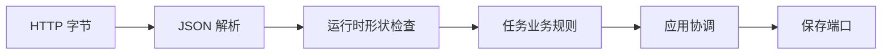

# 第三章：运行时边界与自动化测试

## 类型写对了，客户端就会照做吗

下面的参数类型看起来很安全：

```ts
interface CreateTaskBody {
  readonly title?: string;
}

async function handler(body: CreateTaskBody) {
  return createTask(body.title, "task-1", "2026-08-23T00:00:00Z");
}
```

但 HTTP 客户端不运行我们的 TypeScript 编译器。它仍然可以发送 `null`、数组、数字或 `{ "title": 42 }`。类型只约束已经进入 TypeScript 世界的代码，不能自动改变网络上传来的字节。

本章的问题是：

> 数据从不受我们控制的地方进入程序时，谁负责把“不知道是什么”变成“可以信任的值”？我们又怎样证明这个边界真的有效？

## 先说人话：门外的数据先不要相信

网络、文件、环境变量和数据库返回值都来自程序之外。即使发送方也使用 TypeScript，两边的版本、部署和运行状态仍可能不同。

所以入口应该先把数据看成 `unknown`。程序完成检查之后，内部代码才接收更具体的类型。这个“从不可信到可信”的位置叫作**运行时边界（runtime boundary）**。这里的“运行时”强调检查发生在程序实际执行时，而不只发生在编译阶段。

## 最小改进：把形状检查放在入口

先只检查创建任务需要的字段：

```ts
interface CreateTaskBody {
  readonly title?: string;
}

function readCreateTaskBody(input: unknown): CreateTaskBody {
  if (typeof input !== "object" || input === null || Array.isArray(input)) {
    throw new Error("请求体必须是 JSON 对象");
  }

  if (!("title" in input)) return {};
  if (typeof input.title !== "string") {
    throw new Error("title 必须是字符串");
  }

  return { title: input.title };
}
```

这个函数不决定空标题是否合法。它只确认外部数据的形状；“标题不能为空”仍由任务规则拥有。

于是一次请求分成三种证据：

1. `readCreateTaskBody()` 的测试证明外部形状会被检查。
2. `createTask()` 的测试证明任务规则正确。
3. 应用用例测试证明创建出的任务确实交给保存端口。

只验证一个小单元行为的测试通常称为**单元测试（unit test）**。验证几个真实模块怎样协作的测试可称为**集成测试（integration test）**。名称没有绝对分界，关键是写清测试启动了什么、替换了什么、能发现哪类错误。

## 测试不是给实现拍照

下面的测试关注可观察行为，而不是内部调用了几次 `trim()`：

```ts
import { expect, it } from "vitest";

it("清理合法标题并创建 todo 任务", () => {
  const task = createTask("  学习架构  ", "task-1", "created");

  expect(task).toEqual({
    id: "task-1",
    title: "学习架构",
    status: "todo",
    createdAt: "created",
  });
});
```

如果以后不用 `trim()`，但仍得到相同行为，测试不应失败。测试与私有实现绑得越紧，重构时产生的噪声越多。

## 协调测试证明副作用被交出去

应用用例需要保存任务，但测试不必启动数据库。我们提供一个可观察的替身：

```ts
const saved: Task[] = [];
const repository = {
  save: async (task: Task) => void saved.push(task),
  findById: async () => undefined,
  list: async () => saved,
};

const execute = makeCreateTask({
  repository,
  newId: () => "task-1",
  now: () => "created",
});
```

这里没有假装数据库存在。这个测试只证明用例的协调责任：生成任务、调用保存能力、返回同一个业务结果。真实数据库兼容性要由以后连接数据库的集成测试负责。

## 代价是什么

- 入口校验会增加代码和错误映射。
- 测试需要维护固定输入和预期行为。
- 测试替身可能与真实依赖不一致，因此不能代替全部集成测试。
- 边界过细会让读者在多个文件之间跳转。

自动化测试不是越多越好。它的价值在于用可重复证据保护重要行为和边界。

## 什么时候不需要这么完整

一次性运行、输入完全由同一文件中的常量提供的小脚本，不一定需要独立 Schema 和多层测试。一个只有五行的纯计算也可能只需要几条单元测试。

但只要数据来自 HTTP、文件、环境变量或第三方包，“调用者应该会传对”就不是运行时保证。

## 请用自己的话解释

不要使用“运行时边界”和“单元测试”这两个词，回答：

> 为什么给 HTTP body 标注 TypeScript 类型，仍然不能阻止客户端发送数字标题？哪一段代码应该最先发现它？

## 练习

1. **复述题**：解释入口形状检查、领域规则测试和应用协调测试为什么不能互相替代。
2. **识别题**：列出环境变量 `PORT` 可能出现的三种非法值，并说明检查应放在哪里。
3. **实现题**：给 `readCreateTaskBody()` 增加“拒绝数组”的测试。
4. **取舍题**：一个内部脚本只读取同文件常量，是否需要 Zod？说明当前风险，不引用口号。

## 再用请求流理解



每个箭头旁都可以问：上一步可能给出什么失败结果，下一步是否仍然需要理解原始细节？

## 本章小结

- TypeScript 不会检查网络中实际传来的数据。
- 外部值先保持 `unknown`，在拥有协议的入口完成收窄。
- 形状检查、业务规则和副作用协调是不同测试目标。
- 测试应保护可观察行为，而不是复制当前实现。

可运行代码见 [Task API 的领域测试](../../examples/task-api/tests/task.test.ts)、[应用协调测试](../../examples/task-api/tests/create-task.test.ts)和 [HTTP 边界测试](../../examples/task-api/tests/task-router.test.ts)。
