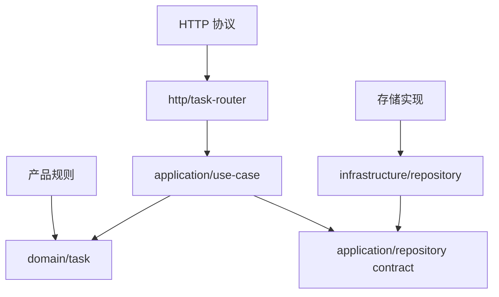

# 第四章：复杂度与模块边界

## 为什么代码不长，却越来越难改

下面的函数只有十几行：

```ts
async function createTask(input: unknown) {
  const config = loadConfig();
  const user = await currentUser();
  const task = validateAndBuildTask(input, user, new Date());
  await database.insert(config.taskTable, task);
  if (config.sendEmail) await email.send(user.email, task);
  metrics.increment("task.created");
  return formatHttpResponse(task);
}
```

它不一定很慢，也不一定有重复代码。但要安全修改标题规则，读者必须同时理解配置、用户、时间、数据库、邮件、指标和 HTTP 返回。

本章要处理的问题是：

> 复杂度究竟来自代码行数，还是来自完成一次修改前必须同时放进脑中的知识？

## 先说人话：难点是“必须一起理解”

当一处修改要求我们同时追踪很多状态、隐含前提和失败路径时，出错概率会上升。这种理解和推理负担可以称为**认知复杂度（cognitive complexity）**。它不是某个工具分数的唯一解释，而是提醒我们观察维护者必须同时记住什么。

模块的价值，是把一组相关知识装在一个有名字的盒子里，并提供有限的接触面。这个盒子称为**模块（module）**；外部允许依赖的函数、类型和行为构成它的**公开接口（public interface）**。

## 文件不是边界，知识限制才是边界

如果 `task-service.ts` import 了数据库连接、邮件 SDK、HTTP 框架类型和全部配置，即使它独占一个目录，也没有把外部知识挡住。

有效边界通常具备三个特征：

1. 内部拥有一类清晰决定。
2. 外部只通过窄接口协作。
3. 内部实现变化时，大多数调用者不必跟着理解和修改。

## 最小改进：先分“决定”和“执行”

任务规则只返回要保存的任务：

```ts
function createTask(
  titleInput: string | undefined,
  id: string,
  createdAt: string,
): Task {
  const title = titleInput?.trim();
  if (!title) throw new Error("任务标题不能为空");
  return { id, title, status: "todo", createdAt };
}
```

外侧用例负责执行副作用：

```ts
async function execute(input: CreateTaskInput): Promise<Task> {
  const task = createTask(input.title, newId(), now());
  await repository.save(task);
  return task;
}
```

现在修改标题规则时，不需要同时理解数据库生命周期；更换保存实现时，也不需要重读标题规则。复杂度没有消失，而是被分配给了更明确的所有者。

## 边界还要管理失败

只讨论成功返回值不够。模块接口还需要说明：

- 找不到任务返回 `undefined`，还是抛出错误？
- 保存失败由谁翻译为 HTTP 500？
- 同一任务重复完成是成功、冲突，还是无操作？
- 调用是否可能超时或取消？

这些约定构成模块的**契约（contract）**。契约不等于必须写一个 TypeScript `interface`；普通函数签名、错误类型和文档也可以表达契约。

## 信息隐藏比复用更基础

很多人提取模块是为了“复用”。但一个模块只使用一次，也可能很有价值：它隐藏数据库、协议或复杂规则，使调用者不用理解内部细节。这称为**信息隐藏（information hiding）**。

相反，一个到处复用的 `helpers.ts` 如果暴露内部状态和不相关知识，反而会扩大修改影响。

## 代价是什么

- 模块增加命名和跳转。
- 公开接口一旦被多人依赖，修改成本可能比内部函数更高。
- 过早隐藏细节可能把错误抽象固定下来。
- 边界太多会让一次简单请求穿过许多无独立价值的转发层。

因此，边界的目标不是“分得最细”，而是让经常独立变化的知识不要被迫一起理解。

## 什么时候不需要继续拆

如果两个步骤总是由同一原因改变、共享同一规则，而且拆开后只能互相传递大量内部状态，那么它们可能本来就属于一个模块。

一个小型路由把 URL 与状态码放在一起也很正常，因为这些都属于 HTTP 协议适配。不要为了让每个文件低于某个行数，把一个完整概念拆成碎片。

## 请用自己的话解释

不要使用“模块”“复杂度”和“信息隐藏”，回答：

> 为什么把数据库保存细节挡在 `repository.save(task)` 后面，能让修改标题规则的人少理解一些东西？

## 练习

1. **复述题**：写出“代码短但难改”的一个原因。
2. **识别题**：检查一个 `utils.ts`，按变化原因把函数分组；若不能分组，说明原因。
3. **实现题**：为 `findById()` 选择 `undefined` 或异常作为不存在结果，并写出调用者代码。
4. **取舍题**：两个总是一起修改的十行函数是否要分文件？说明依据。

## 变化传播图



图的重点不是目录名称，而是每类变化首先落到哪里，以及稳定规则是否反向认识外部技术。

## 本章小结

- 复杂度常来自一次修改必须同时理解的知识量。
- 有效模块通过窄接口隐藏一类决定和内部细节。
- 契约还必须说明失败、缺失和生命周期。
- 拆分不是按行数执行；总是一起变化的知识应尽量待在一起。
