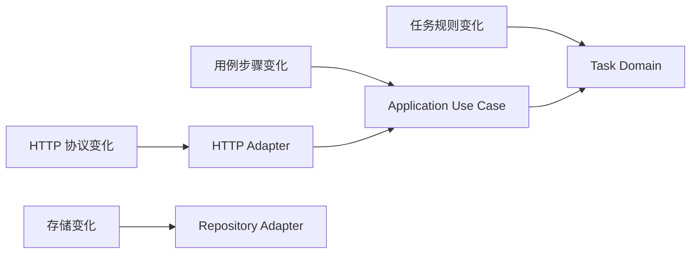

# 第五章：SRP——按变化原因划分职责

## “单一”是不是只能做一件小事

下面的函数完成了创建任务的完整用例：

```ts
async function execute(input: CreateTaskInput): Promise<Task> {
  const task = createTask(input.title, newId(), now());
  await repository.save(task);
  return task;
}
```

它调用了创建、生成 ID、读取时间和保存四个步骤。它是否已经违反“单一职责”？如果把每行再拆成一个类，设计会更好吗？

## 先说人话：看谁会要求它改变

应用用例的工作就是协调一次创建任务。步骤可以有多个，只要这些步骤共同服务同一个用例。

真正混乱的是：产品经理修改标题规则时要改它，DBA 修改 SQL 时也要改它，API 设计者修改状态码时还要改它。不同角色、规则或变化来源争夺同一模块，就说明所有权模糊。

这正是**单一职责原则（Single Responsibility Principle, SRP）**试图描述的现象：一个模块应该主要对一类变化原因或一个清晰所有者负责。它不是“一函数一行”，也不是“一类一个方法”。

## 一个常见反例

```ts
async function createTaskHandler(request: Request) {
  const title = String((await request.json()).title).trim();
  if (!title) throw new Error("标题为空");
  const task = { id: randomUUID(), title, status: "todo" };
  await sqlite.prepare("INSERT INTO tasks ...").run(task);
  return Response.json(task, { status: 201 });
}
```

HTTP 输入、任务规则、SQLite 语句和 HTTP 输出由不同原因变化。问题不是函数做了四步，而是它拥有四类知识。

## 最小改进：给决定找到所有者

先让 HTTP 入口只处理协议，再把用例交给应用函数：

```ts
async function postTasks(body: unknown) {
  const input = readCreateTaskBody(body); // HTTP 输入所有者
  const task = await createTask(input);   // 应用用例所有者
  return { statusCode: 201, body: task }; // HTTP 输出所有者
}
```

`createTask` 用例内部只协调领域规则和保存端口，不再认识 JSON 或状态码。最后，组合根把这些所有者接起来：

```ts
const route = makeTaskRouter({
  createTask: makeCreateTask({ repository, newId, now }),
  completeTask: makeCompleteTask({ repository, now }),
  getTask: makeGetTask(repository),
  listTasks: makeListTasks(repository),
});
```

组合根知道具体对象怎样接起来；HTTP 路由知道协议；应用用例知道步骤；领域函数知道任务规则；Repository 适配器知道怎样保存。

这种分工并不保证永远正确。判断它是否有效，要观察变化：

| 变化 | 首要修改位置 |
| --- | --- |
| 标题最大长度 | `domain/task.ts` |
| 创建成功状态码 | `http/task-router.ts` |
| ID 生成方式 | 组合根提供的 `newId` |
| 内存改 SQLite | Repository 实现与接线 |

如果每种变化大体停在自己的所有者，SRP 就产生了实际收益。

## SRP 不等于分层名称

把全部代码放进 `controllers/`、`services/`、`repositories/` 不会自动得到清晰职责。一个 `TaskService` 仍可能同时发送邮件、执行 SQL、格式化 HTTP 和读取环境变量。

先说清“这个模块拥有什么决定”，再选择文件名和目录。名称是结果，不是证明。

## 代价是什么

- 所有者越清晰，模块通常越多，导航成本会上升。
- 跨边界用例需要一个协调者。
- 错误拆分会导致数据在多个无价值的转发层之间搬运。
- 团队若对“变化原因”理解不同，边界仍会漂移。

SRP 提供观察角度，不提供自动切割算法。

## 什么时候不需要继续拆

标题清理、空值判断和最大长度都属于“怎样形成合法任务标题”，放在同一个领域函数中比创建三个 Validator 类更清楚。

一次性脚本的读取、转换和写出步骤如果不会独立变化，也不必建立完整应用层。拆分必须减少真实修改和验证成本。

## 请用自己的话解释

不要使用“单一职责”，回答：

> 为什么一个包含五个步骤的创建任务用例仍可能设计合理，而一个只有十行的 HTTP handler 却可能拥有太多决定？

## 练习

1. **复述题**：用“谁会要求它改变”解释 SRP。
2. **识别题**：为一个同时发邮件和执行 SQL 的函数列出变化来源。
3. **实现题**：把错误反例最少拆成任务规则和外部协调两部分。
4. **取舍题**：是否应把标题清理和长度检查拆成两个类？说明共同所有者是谁。

## 再看变化怎样停止传播



这个图没有规定每个节点必须是一个类。它只把不同所有者和首要修改位置画出来。

## 本章小结

- 职责不是步骤数量，而是一组由同一所有者维护的知识和决定。
- SRP 的证据是变化更局部、测试需要启动的依赖更少。
- 目录与类名不能代替所有权分析。
- 一个协调者可以合理地调用多个步骤，只要它不拥有各步骤的内部规则。
