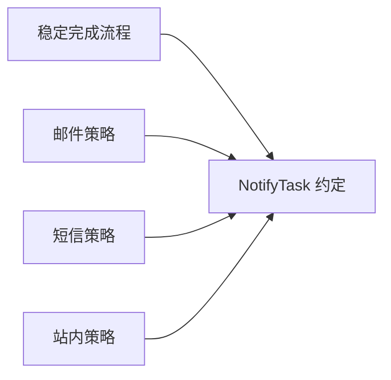

# 第六章：OCP 与 Strategy——让新增规则少改旧代码

## 每加一种规则，都修改同一个条件树

任务通知最初只有邮件，后来增加短信和站内消息：

```ts
async function notify(task: Task, channel: string) {
  if (channel === "email") {
    await email.send(task);
  } else if (channel === "sms") {
    await sms.send(task);
  } else if (channel === "in-app") {
    await inbox.push(task);
  }
}
```

三种渠道时它还容易读。但每新增渠道都要打开旧函数，条件、配置、失败处理和测试会继续增长。

## 先说人话：固定流程和可变规则分开

如果“任务完成后发送通知”的流程稳定，而“怎样发送”持续增加，我们可以让流程只依赖一个发送约定，把具体规则从外部传入。

这种“增加新实现时尽量通过扩展，而不是反复改稳定核心”的目标称为**开闭原则（Open-Closed Principle, OCP）**。这里的“开放”是允许增加行为，“关闭”是稳定部分不必为每个新变体反复修改；它不是说源码永远不能改。

## 最小改进：把变化点变成函数

```ts
type NotifyTask = (task: Task) => Promise<void>;

async function completeAndNotify(
  task: Task,
  notifyTask: NotifyTask,
): Promise<Task> {
  const completed = completeTask(task, new Date().toISOString());
  await notifyTask(completed);
  return completed;
}
```

调用者选择邮件或短信函数。固定流程不再知道渠道名称和 SDK。

把一组可替换算法或行为包装成相同约定，在运行或接线时选择，通常称为**策略模式（Strategy pattern）**。在 TypeScript 中，策略可以只是函数，不一定需要类层次。

## 什么时候条件判断反而更清楚

条件本身不是反模式。如果只有两个稳定分支，而且分支共同依赖大量上下文，直接 `if` 或 `switch` 可能最容易理解。

策略值得出现的信号包括：

- 变体会继续增加；
- 每种变体有独立依赖和测试；
- 核心流程因为变体频繁修改；
- 不同调用者需要选择不同规则。

没有这些信号时，Strategy 只是把一个条件跳转变成文件跳转。

## OCP 不是预测全部未来

我们只对已经观察到的变化轴建立扩展点。今天产品不断增加通知渠道，就隔离渠道；不要顺便抽象“未来可能变化”的序列化、缓存、国际化和插件系统。

错误的扩展点比没有扩展点更难维护，因为团队会被迫遵守一个尚未理解的抽象。

## 代价是什么

- 调用链变间接，实际行为由接线决定。
- 相同函数类型可能隐藏不同的错误和性能特征。
- 策略数量增加后，需要命名、配置和发现机制。
- 调试时要先确认当前选择了哪个实现。

因此策略约定应尽量窄，并由组合根明确选择。

## 什么时候不需要

任务状态只有 `todo` 和 `done`，完成规则也只有一条时，不需要创建 `CompletionStrategyFactory`。直接调用 `completeTask()` 更诚实。

一次性的条件分支、稳定的协议枚举和只有一个合理实现的计算，同样不需要策略模式。

## 请用自己的话解释

不要使用“OCP”和“Strategy”，回答：

> 为什么把 `notifyTask` 作为参数传入后，增加企业微信通知时不必修改完成任务的核心流程？

## 练习

1. **复述题**：解释“对扩展开放、对修改关闭”并不等于禁止修改源码。
2. **识别题**：找出一个持续增长的 `switch`，判断它是否真的是变化点。
3. **实现题**：写两个 `SortTasks` 策略：按创建时间和按标题排序。
4. **取舍题**：只有两个永不增加的状态分支时，为什么 `switch` 可能更好？

## 结构图



## 本章小结

- OCP 关注稳定流程是否被持续增长的变体反复修改。
- Strategy 把已确认的变化点表达为可替换行为。
- TypeScript 函数经常已经足够，不必先建类体系。
- 只为真实变化轴创建扩展点，不预测所有未来。
