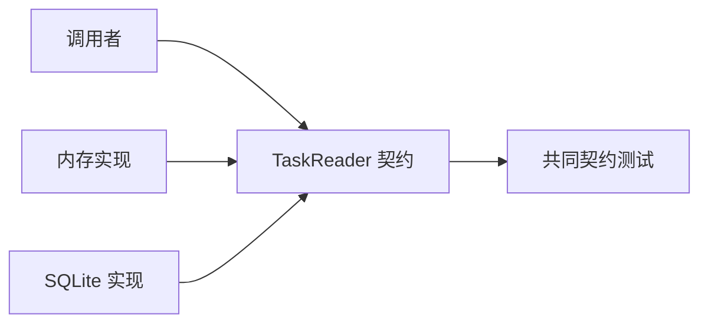

# 第七章：LSP 与 ISP——替换能力和窄接口

## 类型一样，行为就一定能替换吗

我们定义了保存任务的约定：

```ts
interface TaskRepository {
  save(task: Task): Promise<void>;
  findById(id: string): Promise<Task | undefined>;
  list(): Promise<readonly Task[]>;
}
```

某个实现为了“提高性能”，让 `findById()` 在缓存未命中时直接抛错；另一个实现返回 `undefined`。两者都能通过 TypeScript，但调用者不能用同一方式处理。

## 先说人话：替换后不能偷偷改变游戏规则

调用者依赖的不只是方法名和参数类型，还依赖行为约定：找不到意味着什么、是否修改输入、怎样排序、失败是否可重试。

如果一个实现放进约定位置后，迫使调用者增加特殊判断或破坏原有正确性，它就没有真正满足替换关系。这是**里氏替换原则（Liskov Substitution Principle, LSP）**关心的问题：实现应遵守调用者赖以正确工作的契约。

## 一个更隐蔽的违反

```ts
class ReadOnlyTaskRepository implements TaskRepository {
  async save(): Promise<void> {
    throw new Error("只读仓库不能保存");
  }

  // 为突出错误承诺，findById 和 list 的正常实现暂时省略。
  // 即使补全二者，save 仍然不满足 TaskRepository 的行为契约。
}
```

这个类勉强实现了接口，却不具备 `save` 能力。问题不是异常存在，而是类型承诺了可保存，运行时又撤回承诺。

## 最小改进：按调用者需要拆窄接口

```ts
interface TaskReader {
  findById(id: string): Promise<Task | undefined>;
  list(): Promise<readonly Task[]>;
}

interface TaskWriter {
  save(task: Task): Promise<void>;
}
```

只读页面依赖 `TaskReader`；创建任务用例依赖 `TaskWriter`；需要二者的完成任务用例可以依赖组合类型。

让调用者不必依赖自己不用的能力，称为**接口隔离原则（Interface Segregation Principle, ISP）**。这里的“接口”是协作面，不局限于 TypeScript 的 `interface` 关键字。

## 契约至少包含什么

为 `TaskRepository` 设计实现时，应该明确：

- `findById` 找不到返回 `undefined`；
- `save` 成功返回后数据已经对后续读取可见；
- 返回对象是否允许调用者修改；
- `list` 是否保证顺序；
- 哪些失败属于暂时故障，哪些属于数据错误。

类型无法表达全部约定，因此要用测试和文档补足。对多个实现运行同一组**契约测试（contract test）**，可以发现它们是否遵守共同规则。

## 不是接口越小越好

如果每个方法都拆成一个接口，调用者可能需要组合大量碎片，业务概念反而消失。读写总是一起使用、由同一实现提供时，一个 `TaskRepository` 完全合理。

ISP 的目标是避免强迫，而不是追求最少方法数。

## 代价是什么

- 行为契约需要额外文档和测试。
- 接口拆分会增加类型名称和组合。
- 不同实现的性能、事务和一致性仍可能无法完全统一。
- 过度追求替换可能把实现特有的有价值能力压平。

有时正确做法是承认两个能力不同，使用不同接口，而不是假装它们完全可替换。

## 什么时候不需要

只有一个局部实现、没有测试替身，也没有跨模块边界时，不必为了 LSP 先建接口。但函数仍然需要稳定地遵守自己的返回和错误约定。

如果两个存储系统提供根本不同的一致性保证，也不应硬塞进同一个“万能 Repository”。

## 请用自己的话解释

不要使用“LSP”和“ISP”，回答：

> 为什么一个每次调用 `save()` 都抛“只读”错误的类，不应该假装自己是可写 Repository？

## 练习

1. **复述题**：解释方法签名相同为何仍可能不能安全替换。
2. **识别题**：找一个含有“未实现”异常的方法，判断接口承诺是否过宽。
3. **实现题**：拆分 `TaskReader` 和 `TaskWriter`，让列表页面只依赖读取能力。
4. **取舍题**：三个方法总被同一用例使用时，是否仍要拆成三个接口？

## 用契约测试检查多个实现

```ts
async function verifiesMissingTask(repository: TaskReader) {
  expect(await repository.findById("missing")).toBeUndefined();
}
```

内存、SQLite 或远程实现都运行同一组契约测试。它不能证明所有性能和事务特征一致，但能保护调用者明确依赖的共同承诺。



## 本章小结

- 替换关系包含行为、错误和状态约定，不只包含类型形状。
- LSP 要求实现不撤回调用者依赖的承诺。
- ISP 让调用者只认识完成工作需要的能力。
- 当能力本质不同，应使用不同契约，而不是制造虚假的统一。
