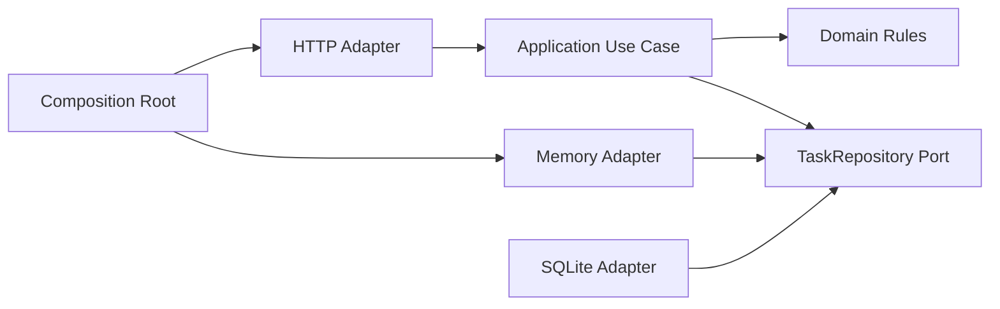

# 第八章：DIP、Adapter、Repository 与依赖注入

## 为什么业务用例不应该直接创建数据库

```ts
async function createTask(input: CreateTaskInput) {
  const database = new SqliteDatabase("tasks.db");
  const task = buildTask(input);
  await database.run("INSERT INTO tasks ...", task);
  return task;
}
```

现在创建任务用例知道 SQLite 类、文件位置和 SQL。测试业务协调时必须面对真实数据库，换存储方式也会修改用例。

## 先说人话：让重要规则定义它需要什么

用例真正需要的不是“SQLite”，而是“保存任务”。因此由应用一侧定义一个窄约定：

```ts
interface TaskRepository {
  save(task: Task): Promise<void>;
  findById(id: string): Promise<Task | undefined>;
  list(): Promise<readonly Task[]>;
}
```

具体数据库来遵守这个约定。这样，稳定的业务流程不再 import 易变的技术实现。

让高层策略不直接依赖低层细节，而让两边依赖面向业务需要的抽象，称为**依赖倒置原则（Dependency Inversion Principle, DIP）**。倒置的是源码依赖的控制权，不是运行时数据必须反向流动。

## 三个常被混在一起的词

### Adapter

把外部技术的接口翻译成程序内部需要的接口，称为**适配器（Adapter）**。例如 `InMemoryTaskRepository` 把 `Map` 操作翻译为 `save/findById/list`。

```ts
class InMemoryTaskRepository implements TaskRepository {
  readonly #tasks = new Map<string, Task>();

  async save(task: Task): Promise<void> {
    this.#tasks.set(task.id, { ...task });
  }
}
```

### Repository

为领域或应用提供“像集合一样读取和保存对象”的持久化边界，通常称为**仓储（Repository）**。它隐藏 SQL 和驱动细节，但不应该假装数据库的事务、查询和一致性从此不存在。

### Dependency Injection

对象不在内部创建自己的依赖，而由外部传入，称为**依赖注入（dependency injection, DI）**：

```ts
const createTask = makeCreateTask({
  repository,
  newId: randomUUID,
  now: () => new Date().toISOString(),
});
```

DI 是接线方式，不等于必须使用容器。普通参数和工厂函数已经是依赖注入。

## 组合根拥有“选择具体实现”的责任

程序总要有一个地方知道 `InMemoryTaskRepository` 或 `SqliteTaskRepository`。这个集中接线的位置称为**组合根（composition root）**。

它可以读取配置并选择实现，但领域规则和应用用例不应到处重复选择逻辑。把具体对象集中在入口，能让依赖方向更容易检查。

## 代价是什么

- 抽象和接线增加间接性。
- Repository 设计过宽时会变成另一个万能服务。
- 为每个类都建接口会产生大量没有替换价值的文件。
- 把数据库能力隐藏得过度，会让事务和查询性能问题难以表达。

DIP 不是把技术细节消灭，而是把它们放回拥有它们的边缘。

## 什么时候不需要

一个只调用一次的本地脚本直接使用 SQLite 很可能足够。一个纯函数没有外部依赖，也不需要 Repository 或 DI。

当具体实现稳定、测试可直接使用且不会污染核心规则时，额外抽象可能不值。先用窄函数参数，等协作能力增长后再命名为正式端口，往往更稳妥。

## 请用自己的话解释

不要使用“依赖倒置”和“依赖注入”，回答：

> 为什么由创建任务用例声明“我需要保存任务”，比让它自己创建 SQLite 客户端更容易测试和更换实现？

## 练习

1. **复述题**：说明运行时调用数据库和源码依赖数据库不是同一件事。
2. **识别题**：找出代码中直接读取 `process.env` 或创建 SDK 客户端的业务函数。
3. **实现题**：写一个只记录任务 ID 的 `TaskWriter` 测试替身。
4. **取舍题**：只有一个五行存储函数时，为何函数参数可能比 DI 容器更好？

## 依赖与运行流



运行时数据最终仍进入具体适配器；源码中，应用只认识自己定义的端口。

## 本章小结

- DIP 让稳定用例依赖业务需要的约定，而不是具体技术。
- Adapter 翻译接口，Repository 表达持久化协作，DI 负责从外部提供依赖。
- 普通函数参数已经可以完成依赖注入。
- 组合根集中选择具体实现；不要让选择逻辑渗进领域规则。

对应实现见 [TaskRepository](../../examples/task-api/src/application/task-repository.ts)、[内存适配器](../../examples/task-api/src/infrastructure/in-memory-task-repository.ts)和[组合根](../../examples/task-api/src/main.ts)。
