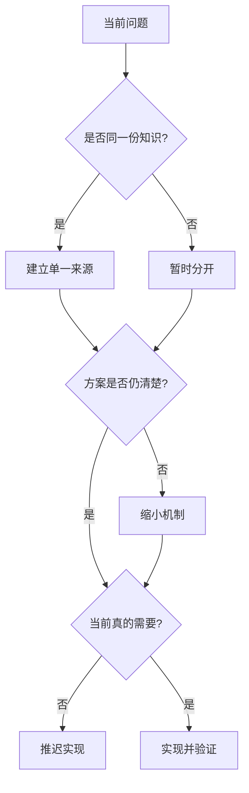

# 第九章：DRY、KISS、YAGNI 与互补原则

## 三条好原则为什么会互相打架

创建和重命名任务都检查标题：

```ts
function createTask(title: string) {
  if (!title.trim()) throw new Error("标题为空");
  // 创建逻辑
}

function renameTask(task: Task, title: string) {
  if (!title.trim()) throw new Error("标题为空");
  // 重命名逻辑
}
```

看到重复后，我们可能立刻建立通用校验框架。但如果创建标题最大 100 字，重命名又允许保留旧标题，两个规则很快就会分开。过早合并会让不同概念被迫共享。

## DRY：不要重复同一份知识

**DRY（Don't Repeat Yourself）**更准确的理解是：同一条决定不要在多个地方分别维护。它不等于任何两段相似代码都必须合并。

数据库状态值、错误码和业务规则若被复制到多处，修改时容易遗漏；两个暂时相似、由不同原因变化的 UI 片段，则未必是同一知识。

```ts
function normalizeTaskTitle(input: string): string {
  const title = input.trim();
  if (!title) throw new TaskRuleError("任务标题不能为空");
  if (title.length > 100) throw new TaskRuleError("标题过长");
  return title;
}
```

只有确认创建与重命名遵守同一规则时，这个提取才减少了知识重复。

## KISS：优先选择能解释清楚的最小方案

**KISS（Keep It Simple）**不是拒绝设计，而是避免没有收益的复杂机制。能用函数参数表达的依赖，不先引入容器；能用 `switch` 看清的三个稳定状态，不先创建插件系统。

简单不是代码最少，而是正确理解、修改和排错所需的规则更少。

## YAGNI：没有当前需要，就先不建

**YAGNI（You Aren't Gonna Need It）**提醒我们不要为猜测的未来支付今天的维护成本。

当前 Task API 没有多租户、离线同步和消息队列需求，所以不建立租户抽象、CRDT 或通用事件总线。将来需求出现时再基于真实约束设计，通常比今天猜一个万能接口更可靠。

YAGNI 不等于不考虑未来。保留清晰边界、测试和迁移能力，就是为未来降低风险；提前实现未经要求的功能则是另一回事。

## 还需要两条互补判断

### 组合优先于继承

应用行为经常通过函数和对象组合更容易替换。继承适合真正稳定的“是一个”关系和共同契约，不适合只为了复用几行实现。

### 显式优先于隐式

把 `repository`、`now` 和 `newId` 作为依赖传入，比从全局单例偷偷读取更容易看见、测试和替换。显式会多写一些代码，却减少隐藏前提。

## 一套实际决策顺序

遇到重复或扩展需求时，依次问：

1. 这是同一条知识，还是只是长得像？
2. 当前最简单的正确方案是什么？
3. 新抽象解决了已经发生的问题，还是猜测未来？
4. 以后改变决定时，迁移是否仍可控？

这四问比机械套用任何缩写更可靠。

## 代价是什么

- 保持重复一段时间，可能需要以后再合并。
- 选择简单实现，未来需求出现时可能重构。
- 拒绝预测性抽象，需要团队接受“现在还不知道”。
- DRY 过度会形成通用框架；KISS 过度会忽视真实风险；YAGNI 过度会成为拒绝基础测试和迁移设计的借口。

原则必须围绕具体上下文互相制衡。

## 什么时候不需要抽象重复

两个模块各有三行格式化代码，但由不同产品团队维护、输出协议也可能独立变化时，暂时重复可能比建立共享包更安全。

当复制错误码会造成协议不一致时，则应建立单一来源。判断依据是知识所有权，而不是重复行数。

## 请用自己的话解释

不要使用 DRY、KISS 和 YAGNI，回答：

> 为什么两段相似代码有时应该合并，有时应该暂时保留？

## 练习

1. **复述题**：解释“重复知识”和“重复文本”的区别。
2. **识别题**：找出一个为未来功能预留但从未使用的抽象。
3. **实现题**：把多个地方重复的任务状态字符串改为一个明确的类型来源。
4. **取舍题**：现在只有内存存储，是否应建立通用 ORM 层？列出真实收益和成本。

## 三条原则怎样互相制衡



它们不是按固定顺序执行的审批流程，而是一组互相纠偏的问题：不要重复同一决定，也不要为了消除表面重复建立当前不需要的复杂框架。

## 本章小结

- DRY 保护单一知识来源，不要求消灭所有相似代码。
- KISS 选择当前最容易正确理解和维护的方案。
- YAGNI 推迟没有真实需求支撑的功能和抽象。
- 组合与显式依赖常能减少隐藏状态，但同样要由当前问题证明价值。
