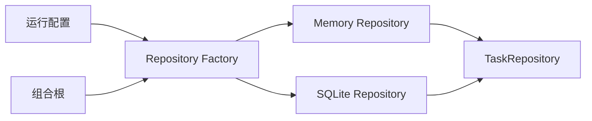

# 第十章：Factory 与 Builder——管理创建复杂度

## `new` 本身不是问题

Task API 的组合根直接创建内存 Repository：

```ts
const repository = new InMemoryTaskRepository();
const createTask = makeCreateTask({
  repository,
  newId: randomUUID,
  now: () => new Date().toISOString(),
});
```

这段代码很清楚。若只有一个实现和几个参数，为它再创建五个工厂只会增加跳转。

真正的问题在创建规则开始增长时出现：测试、开发和生产需要不同存储；对象构建还依赖配置、连接生命周期和安全默认值。谁来保证这些对象被正确组装？

## Factory：给“选择并创建”一个名字

把对象选择和构建集中到一个函数，通常称为**工厂（Factory）**。它隐藏的是创建规则，而不是普通的 `new` 关键字。

```ts
function createRepository(config: AppConfig): TaskRepository {
  if (config.storage === "memory") {
    return new InMemoryTaskRepository();
  }

  return new SqliteTaskRepository(config.databaseFile);
}
```

调用者只说“根据配置给我任务存储”。具体构造器、连接参数和实现选择停在工厂中。

工厂有价值的当前变化是：存储实现和构造方式可能改变，而应用用例不应参与这些变化。

## Builder：分步骤构造一个复杂结果

任务导出配置含多个可选项时，一个长参数列表会变得难读：

```ts
const report = new TaskReportBuilder()
  .forProject("architecture-course")
  .includeCompleted(false)
  .sortBy("createdAt")
  .withLimit(100)
  .build();
```

把复杂对象分步骤配置，最后统一验证并生成结果，称为**建造者（Builder）**。它适合“相同构建过程产生多种配置结果”，尤其当参数存在顺序、默认值或组合约束时。

TypeScript 中通常先考虑普通对象参数：

```ts
const report = createTaskReport({
  projectId: "architecture-course",
  includeCompleted: false,
  sortBy: "createdAt",
  limit: 100,
});
```

如果对象参数已经清楚且能一次验证，就不必引入链式 Builder。

## Factory 与 Builder 的区别

| 问题 | Factory | Builder |
| --- | --- | --- |
| 主要变化 | 选择哪种具体实现、怎样创建 | 一个复杂结果怎样逐步配置 |
| 常见结果 | 返回某个可替换对象 | 最后 `build()` 返回完整对象 |
| 调用者关心 | 想要哪类能力 | 想设置哪些构建选项 |

二者可以组合：Factory 先选择某种 Builder，但小项目通常不需要这层组合。

## 代价是什么

- 工厂可能变成包含所有类型选择的巨大 `switch`。
- Builder 可能允许无效的中间状态或漏调 `build()`。
- 创建逻辑被隐藏后，调试时要多跳一层。
- 为每个简单对象配工厂，会让直接构造变得不必要地神秘。

## 什么时候不需要

一个构造器只有两个明显参数，且所有调用者都使用同一种实现时，直接 `new` 最清楚。

配置能用一个带明确字段名的对象表达时，优先使用普通函数和对象参数。只有创建规则本身已成为独立变化或验证问题，Factory/Builder 才值得存在。

## 请用自己的话解释

不要使用“Factory”和“Builder”，回答：

> 为什么选择存储实现适合集中在一个创建函数里，而四个简单配置字段未必需要链式对象？

## 练习

1. **复述题**：解释 `new` 为什么不是必须消灭的问题。
2. **识别题**：找一个散落在多个入口的对象创建规则，列出它们可能不一致的地方。
3. **实现题**：写 `createRepository({ storage: "memory" })` 的最小工厂。
4. **取舍题**：一个含三个必填字段的任务对象，使用普通对象参数还是 Builder？说明依据。

## 创建流程图



## 本章小结

- Factory 管理已经复杂化的选择和创建规则。
- Builder 管理需要分步骤配置、最后统一验证的复杂结果。
- 普通构造器和对象参数是更简单的默认选择。
- 模式存在的证据应是创建规则正在重复、分叉或产生无效组合。
