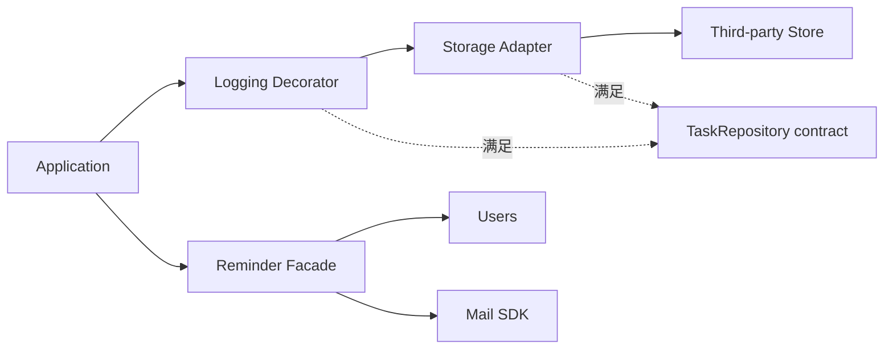

# 第十一章：Adapter、Facade 与 Decorator——三种“包一层”并不相同

## 为什么同样是包装对象，名字却不同

假设任务保存需要日志：

```ts
class LoggedTaskRepository implements TaskRepository {
  constructor(private readonly inner: TaskRepository) {}

  async save(task: Task): Promise<void> {
    console.log("saving task", task.id);
    await this.inner.save(task);
  }
}
```

它包住另一个 Repository。有人会把它叫 Adapter，有人叫 Facade，也有人叫 Decorator。要判断名称，不能只看“外面套了一层”，而要看这一层解决什么变化。

## Adapter：把不匹配的接口翻译成内部语言

第三方存储只提供 `put(key, json)`，应用需要 `save(task)`：

```ts
class KeyValueTaskRepository implements TaskRepository {
  constructor(private readonly store: KeyValueStore) {}

  async save(task: Task): Promise<void> {
    await this.store.put(task.id, JSON.stringify(task));
  }
}
```

它把外部接口翻译为应用拥有的接口。这是**适配器（Adapter）**：让原本不匹配的协作面能够连接，并把第三方数据、错误和命名限制在边缘。

## Facade：给复杂子系统一个更小入口

发送任务提醒需要查用户、渲染模板、调用邮件 SDK：

```ts
class TaskReminderFacade {
  constructor(
    private readonly users: UserRepository,
    private readonly templates: TemplateRenderer,
    private readonly mail: Mailer,
  ) {}

  async send(task: Task, userId: string): Promise<void> {
    const user = await this.users.find(userId);
    const message = this.templates.render("task-reminder", { task, user });
    await this.mail.send(user.email, message);
  }
}
```

它没有把一种接口翻译成同等能力的另一种接口，而是为复杂子系统提供一个更简单的入口。这是**外观（Facade）**。

Facade 隐藏协调细节，但也可能隐藏失败和事务语义。因此入口必须说明它真正保证什么。

## Decorator：保持接口不变，叠加行为

前面的 `LoggedTaskRepository` 保留 `TaskRepository` 接口，同时添加日志。这样的包装称为**装饰器（Decorator）**。

```ts
const repository = new LoggedTaskRepository(
  new InMemoryTaskRepository(),
);
```

缓存、指标、重试和权限检查也常被写成 Decorator，但只有当增强行为能遵守原契约时才安全。例如重试 `save()` 前必须先考虑是否幂等。

## 三者怎样区分

| 模式 | 主要目的 | 接口变化 |
| --- | --- | --- |
| Adapter | 翻译不匹配接口 | 通常从外部接口变为内部接口 |
| Facade | 简化复杂子系统 | 提供更高层、更窄入口 |
| Decorator | 叠加横切行为 | 对调用者保持同一接口 |

名称不是考试答案。更重要的是明确这一层拥有翻译、简化还是增强责任。

## 代价是什么

- 包装层会拉长调用链和错误堆栈。
- Facade 可能成长为万能服务。
- Decorator 顺序可能影响行为，例如缓存包重试与重试包缓存并不等价。
- Adapter 若泄露第三方类型，就没有真正隔离变化。

## 什么时候不需要

外部 SDK 的接口已经和用例需要完全一致时，直接调用可能更清楚。一个只有两步、只在一处使用的子系统也未必需要 Facade。

日志只在 HTTP 请求边界统一记录时，不必为每个 Repository 创建 Decorator。先找到行为真正的所有者。

## 请用自己的话解释

不要使用三个模式名称，回答：

> “把第三方 `put()` 翻译成 `save()`”和“给 `save()` 增加日志”分别改变了什么？

## 练习

1. **复述题**：分别用“翻译、简化、增强”解释三种包装。
2. **识别题**：判断 API client 的错误映射层更接近哪一种，并说明依据。
3. **实现题**：写一个记录 `save` 耗时的 Repository Decorator。
4. **取舍题**：只有一个第三方调用且接口已匹配时，是否需要 Adapter？

## 结构图



## 本章小结

- Adapter 翻译接口并隔离外部细节。
- Facade 给复杂子系统一个有业务含义的窄入口。
- Decorator 保持原接口并叠加行为。
- “包一层”不是理由；翻译、简化或增强的当前问题才是理由。
