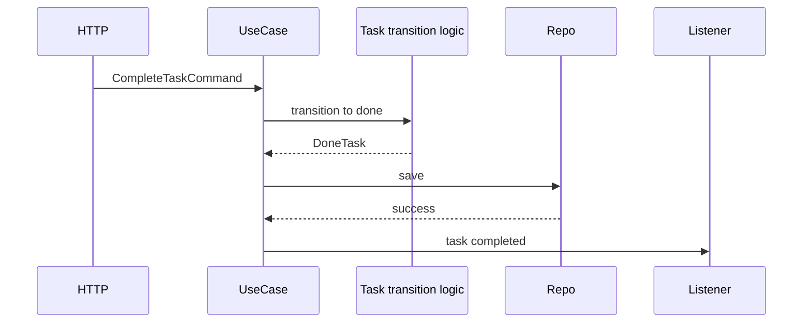

# 第十二章：Observer、Command 与 State——管理通知、意图和状态变化

## 一个完成动作为什么越写越长

任务完成后，产品逐渐要求发通知、记审计、更新指标：

```ts
async function completeTask(taskId: string) {
  const task = await repository.findById(taskId);
  const completed = markDone(task);
  await repository.save(completed);
  await mail.send(completed);
  await audit.write(completed);
  metrics.increment("task.completed");
}
```

核心状态变化被越来越多的后续动作包围。我们需要先区分三个问题：谁想做什么、状态怎样变化、完成后谁需要知道。

## Command：把一次意图变成数据或对象

```ts
interface CompleteTaskCommand {
  readonly type: "complete-task";
  readonly taskId: string;
  readonly requestedBy: string;
}
```

把“请完成这个任务”的意图和所需数据封装起来，称为**命令（Command）**。它可以被验证、排队、记录或重放，但不必一开始就创建 Command Bus。

HTTP `POST /tasks/:id/complete` 可以翻译为命令，再由用例处理。这样 HTTP 字段不会直接成为领域模型。

## State：让行为随状态改变

如果状态越来越多，条件会扩散：

```ts
function canComplete(status: TaskStatus): boolean {
  return status === "todo" || status === "in_progress";
}
```

把每个状态允许的行为和迁移集中管理，称为**状态模式（State pattern）**或更一般的显式状态机。简单系统通常先使用联合类型和集中 `switch`：

```ts
type TaskState =
  | { readonly status: "todo" }
  | { readonly status: "blocked"; readonly reason: string }
  | { readonly status: "done"; readonly completedAt: string };
```

只有当每个状态拥有大量不同操作时，才考虑状态对象。联合类型已经能让无效组合更难表示。

## Observer：完成后通知感兴趣的一方

```ts
type TaskCompletedListener = (task: DoneTask) => Promise<void>;

async function notifyCompleted(
  task: DoneTask,
  listeners: readonly TaskCompletedListener[],
): Promise<void> {
  await Promise.all(listeners.map((listener) => listener(task)));
}
```

一个发布者不直接认识所有后续动作，而向已注册监听者通知，称为**观察者（Observer）**。它降低发布者对具体接收者的认识，但引入执行顺序、失败归属和并发问题。

这个最小示例的契约是：任一监听者失败，`notifyCompleted()` 就失败；其他已经启动的监听者不会被自动取消。真实系统必须进一步决定是汇总 `Promise.allSettled()` 的结果、重试、记录死信，还是让通知失败影响主操作。

## 三个模式放在一条流里

```text
Command：外部想做什么
State：当前允许怎样变化
Observer：变化成功后谁需要知道
```

它们不是必须同时出现。Task API 当前直接调用用例最清楚；当排队、历史记录、复杂状态或多个独立后续动作真实出现时，再逐步引入。

## 代价是什么

- Command 对象和分发器会增加间接层。
- State 对象过早出现会制造大量小类。
- Observer 让调用关系不再从源码一眼可见。
- 并行监听者可能部分成功、部分失败；顺序监听者又可能变慢。

通知是否属于同一事务、失败是否阻止主操作，必须明确，而不能交给模式名称决定。

## 什么时候不需要

只有一个调用者和一个同步处理函数时，不需要 Command Bus。状态只有 `todo/done` 两种简单迁移时，普通函数和联合类型足够。

完成任务后只有一个必须执行的审计动作时，直接调用比通用事件系统更容易看见失败。

## 请用自己的话解释

不要使用三个模式名称，回答：

> 为什么“用户要求完成任务”“任务能否从当前状态完成”“完成后发通知”是三类不同问题？

## 练习

1. **复述题**：分别说明意图、状态迁移和后续通知由谁拥有。
2. **识别题**：找出一个散落在多个函数中的状态判断。
3. **实现题**：给 `blocked` 状态添加只能先回到 `todo` 的迁移规则。
4. **取舍题**：只有一个邮件通知时，直接调用和 Observer 哪个更好？

## 事件流图



图中的 `Task transition logic` 表示集中状态迁移规则，不要求实现为 State 类或独立运行时对象。

## 本章小结

- Command 表达一次请求执行的意图和数据。
- State 集中状态允许的行为与迁移。
- Observer 把成功变化通知给不必由核心流程具体认识的接收者。
- 模式引入了顺序、失败和可见性成本，必须由当前问题证明价值。
