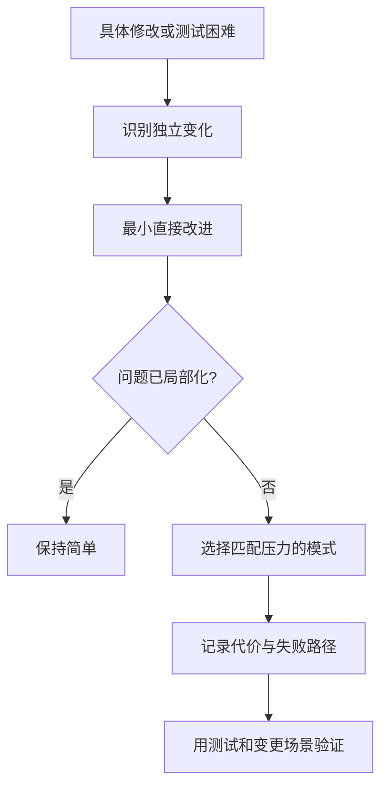

# 第十三章：模式选择与反模式

## 从名称出发，为什么越设计越复杂

假设需求只是“创建任务后保存在内存中”。如果先决定使用全部熟悉的模式，可能得到下面这段用于说明间接层的伪代码；相关工厂和总线实现均被省略：

```ts
const command = taskCommandFactory.create("create", body);
const strategy = strategyLocator.resolve(command);
const repository = repositoryFactory.create(config);
await commandBus.dispatch(command, strategy, repository);
```

这段代码未必错误，但当前问题只有一个输入、一条规则和一个保存动作。新增名称没有减少真实变化，反而要求读者理解更多运行机制。

## 先说人话：从压力选择工具

模式是反复出现的设计问题与取舍的命名。选择模式时先描述压力：

- 接口不匹配？考虑 Adapter。
- 变体持续增加并修改稳定流程？考虑 Strategy。
- 创建规则复杂且散落？考虑 Factory。
- 状态迁移分散？考虑显式状态机或 State。
- 多个独立接收者需要知道变化？考虑 Observer。

这叫按**设计压力（design force）**选择，而不是按目录或流行程度选择。

## 一个四步选择法

1. 写出当前修改或测试为什么困难。
2. 标出哪类知识在独立变化。
3. 选择能限制这类变化的最小边界。
4. 写出新增间接性、失败模式和不用它的条件。

如果第一步说不清，先保持直接代码。

## 常见反模式

**反模式（anti-pattern）**不是“我不喜欢的代码”，而是看似通用、反复使用，却经常产生已知负面结果的方案。

### God Object

`TaskManager` 同时处理 HTTP、规则、数据库、邮件、缓存和日志。所有变化集中到一个知道一切的对象。

### Service Locator

```ts
function createTask() {
  const repository = services.get("taskRepository");
  const clock = services.get("clock");
  // 隐藏依赖
}
```

依赖从参数中消失，却藏进全局查找。测试和阅读者无法从签名知道函数需要什么。

### Singleton 共享状态

全局单例数据库、缓存或当前用户使测试相互影响，也让生命周期和并发所有权模糊。进程内只有一个实例不必然错误；问题是隐式、可变、难以重置的共享状态。

### Golden Hammer

因为团队熟悉 Redux、事件总线或微服务，就用它解决所有问题。这称为“拿着锤子看什么都像钉子”。

### Cargo Cult

复制大公司目录和模式，却无法说明当前变化与收益。形式保留了，约束和规模背景却丢失了。

## 代价是什么

模式选择本身需要经验和证据。一个模式可能在局部降低修改成本，却把调试、部署或运行故障移到系统层面。

没有任何模式能代替领域知识。模式接口命名错误时，只会让错误理解更稳定、更难修改。

## 什么时候不需要模式名称

一个函数参数、一个普通对象或一个 `switch` 已经把问题说明清楚时，可以直接使用。代码评审中说“把外部 SDK 翻译到我们的接口”往往比争论它是不是标准 GoF Adapter 更有价值。

只有当名称帮助团队复用共同判断和取舍时，模式词汇才产生收益。

## 请用自己的话解释

不要使用任何模式名，回答：

> 为什么应该先写出当前修改困难，再决定是否增加一个抽象层？

## 练习

1. **复述题**：解释“模式是问题和取舍的名字”。
2. **识别题**：在代码中找一个隐藏依赖的全局对象。
3. **实现题**：把 Service Locator 改为显式函数参数。
4. **取舍题**：一个三分支稳定 `switch` 是否应改成 Strategy？列出证据。

## 模式决策流



## 本章小结

- 从当前设计压力选择模式，不从模式目录反推代码。
- 先尝试最小直接改进，再判断是否需要命名模式。
- 反模式的危险来自隐藏依赖、集中变化或复制失去背景的形式。
- 模式名称只有在帮助团队交流问题、约束和代价时才有价值。
