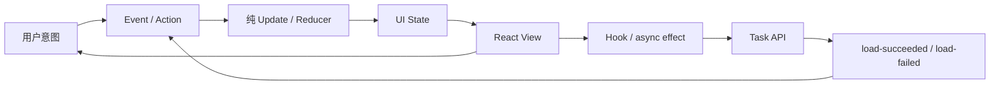

# 第十四章：MVC、MVP、MVVM、MVU、Flux、Redux 与 React 边界

## 一个组件为什么很快变成第二个后端

```tsx
function TaskPage() {
  const [tasks, setTasks] = useState<Task[]>([]);
  const [title, setTitle] = useState("");
  const [loading, setLoading] = useState(false);
  const [error, setError] = useState<string>();

  // 请求、校验、缓存、筛选、通知和渲染都继续写在这里
}
```

React 组件一开始同时拥有这些状态很正常。但随着请求、筛选、乐观更新和错误恢复加入，远程数据、页面交互和视图渲染会互相牵连。

本章不要求背 UI 架构家谱，而是问：

> 哪一种状态由谁拥有，用户意图怎样变成状态变化，渲染代码需要知道多少外部细节？

## 先分清三类状态

1. **服务端状态**：任务列表来自 API，存在加载、过期和失败。
2. **页面交互状态**：当前筛选条件、选中任务、对话框是否打开。
3. **局部输入状态**：标题输入框正在输入的文字。

它们生命周期不同，不应默认全部放进一个全局 Store，也不应全部塞在一个组件里。

React 官方“Thinking in React”强调从组件层次和最小状态表示出发，并把状态放到需要它的最近共同所有者。这里的核心不是框架规则，而是**状态所有权（state ownership）**：谁能改变它、谁需要读取它、它活多久。

## MVC、MVP 与 MVVM 先用职责理解

- **MVC**：Model 保存业务数据与规则，View 展示，Controller 解释输入并协调。
- **MVP**：Presenter 主动读取/更新 View 接口，便于把展示逻辑从具体 UI 技术中测试。
- **MVVM**：ViewModel 提供适合绑定和渲染的状态与命令，View 主要声明怎样展示。

这些名字在不同平台含义并不完全一致。Qt、桌面 GUI 和 Web 的 Controller/ViewModel 生命周期不同，不能只凭文件名认定架构。

## React 中的最小边界

```tsx
function useTasks(api: TaskApi) {
  const [state, setState] = useState<TasksState>({ type: "loading" });

  useEffect(() => {
    api.list().then(
      (tasks) => setState({ type: "ready", tasks }),
      (error: unknown) => setState({ type: "failed", message: toMessage(error) }),
    );
  }, [api]);

  return state;
}
```

这个 Hook 拥有加载生命周期；组件根据 `TasksState` 渲染。它有一点 ViewModel 思想，但不必为了名称创建类。

调用者需要保持 `api` 引用稳定，否则 effect 会重复执行。生产代码还应使用 `AbortController` 或请求序号处理卸载、取消和旧请求晚到的问题；这里省略这些代码，只突出状态所有权。

使用可区分联合类型能避免 `loading=true`、`error` 和 `tasks` 同时出现的无效组合。

## MVU、Flux 与 Redux 在解决什么

**MVU（Model-View-Update）**把 UI 状态视为 Model，事件交给纯 Update 函数产生新状态，再由 View 渲染。它让状态转移集中、可测试。

**Flux** 强调单向数据流：Action 描述发生了什么，Dispatcher/Store 更新状态，View 重新渲染。

经典 **Redux** 模型把这种思路具体化为单一 Store、Action 和 Reducer，并提供成熟调试生态；现代 Redux 通常使用 Redux Toolkit 的 slice、middleware 和数据请求工具组织这些概念。它适合大量跨组件共享、变化来源复杂且需要可追踪的客户端状态；并不是所有 React 应用的默认必需品。

```ts
function update(state: TasksState, event: TasksEvent): TasksState {
  if (event.type === "load-succeeded") {
    return { type: "ready", tasks: event.tasks };
  }
  if (event.type === "load-failed") {
    return { type: "failed", message: event.message };
  }
  return state;
}
```

## 前后端边界：共享契约，不共享内部模型

React 客户端依赖 HTTP JSON 契约，不应 import 后端数据库实体。可以从 OpenAPI 或共享 Schema 生成/推导传输类型，但前端仍要处理版本差异和不可信响应。

后端的 `Task` 领域类型与前端的 `TaskDto` 可能暂时相同，却由不同运行环境拥有。不要为了 DRY 让前端反向依赖后端内部模块。

## 代价是什么

- Hook、Reducer 或 Store 都增加新状态所有者。
- 全局状态让局部组件更难独立复用。
- 乐观更新需要回滚和并发冲突处理。
- 共享类型包可能掩盖运行时版本不兼容。

## 什么时候不需要

一个表单的输入只被本组件使用，就留在本地 `useState`。一个页面只有加载和显示，不必建立 Redux Store、Action、Selector 和 Middleware。

只有当状态跨越多个组件、事件来源多、转移难以追踪或调试证据不足时，再引入 Reducer、状态库或更正式的 ViewModel。

## 请用自己的话解释

不要使用 MVC、MVVM、Flux 或 Redux，回答：

> 为什么输入框文字、远程任务列表和全站当前用户不一定应该由同一个地方保存？

## 练习

1. **复述题**：按生命周期解释三类 UI 状态。
2. **识别题**：在一个组件中找出远程数据、页面状态和局部输入。
3. **实现题**：用联合类型表示 loading、ready、failed 三种互斥状态。
4. **取舍题**：只有两个兄弟组件共享筛选条件时，使用提升状态还是 Redux？

## 单向数据流



## 本章小结

- UI 架构首先是状态和决定的所有权问题。
- MVC、MVP、MVVM 的共同目标是避免展示、输入协调与业务知识完全混合。
- MVU、Flux 和 Redux强调显式状态转移与单向数据流。
- React 先使用局部状态、提升状态和 focused Hook；只有真实共享与追踪问题出现时再增加全局 Store。

延伸阅读：[React：Thinking in React](https://react.dev/learn/thinking-in-react)、[Redux 官方文档](https://redux.js.org/)。
