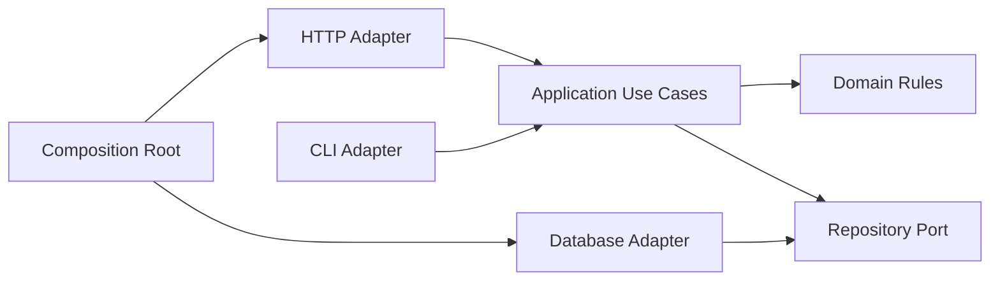

# 第十五章：分层、六边形与 Clean Architecture

## 目录分了四层，为什么依赖还是乱的

```ts
// domain/task-service.ts
import { FastifyReply } from "fastify";
import { sqlite } from "../infrastructure/database.js";

export async function createTask(reply: FastifyReply, title: string) {
  await sqlite.run("INSERT INTO tasks ...");
  return reply.code(201).send({ title });
}
```

文件虽然放在 `domain`，却直接认识 HTTP 框架和数据库。目录名称说它在内部，源码依赖却把外部技术拉了进来。

本章的问题是：

> 分层架构、六边形架构和 Clean Architecture 到底在保护什么共同规则，又为什么不能只复制目录模板？

## 分层架构：给不同职责安排上下关系

常见分层把系统分成展示、业务和数据访问：

```text
Presentation → Business → Data Access
```

这首先是一次请求的逻辑调用示意，不代表业务源码必须 import 数据库实现。它的价值是让 HTTP/UI、业务规则和持久化不全部混在一起。但“上层调用下层”如果被理解为业务必须 import 数据库实现，技术细节仍会控制业务结构。

分层是组织职责的一种方式，不代表每次请求都必须经过 Controller、Service、Manager、DAO 四个转发对象。

## 六边形架构：应用在中心，技术通过端口连接

Alistair Cockburn 提出的**六边形架构（Hexagonal Architecture）**也常称 Ports and Adapters。核心想法是：应用通过自己定义的端口与外部世界协作，HTTP、数据库、测试和 CLI 都是适配器。

下面省略 `Task`、`CreateTaskInput`、领域构造函数和 ID/时间依赖的定义，只展示应用端口怎样由用例使用；具体 Repository 由组合根注入：

```ts
interface TaskRepository {
  save(task: Task): Promise<void>;
}

function makeCreateTask(repository: TaskRepository) {
  return async (input: CreateTaskInput) => {
    const task = createTask(input.title, newId(), now());
    await repository.save(task);
    return task;
  };
}
```

“六边形”不是要求画六条边。图形只是提醒我们：应用可能有多个输入和输出适配器，核心不应该被其中某一种技术定义。

## Clean Architecture：依赖指向更稳定的策略

**Clean Architecture** 常把系统画成同心圆：Entities、Use Cases、Interface Adapters、Frameworks。核心规则是源码依赖向内指向更稳定的业务策略，外层数据需要翻译成内层能理解的形式。

它和六边形架构有共同点：

- 业务规则不直接依赖框架和数据库；
- 外部技术通过边界适配；
- 组合根在最外侧接线；
- 测试可以从不同适配器驱动同一应用。

区别更多在术语、图形和强调重点，而不是互斥的实现代码。

## 最小可用结构

当前 Task API 只使用需要的职责：

```text
src/
  domain/task.ts
  application/create-task.ts
  application/task-repository.ts
  infrastructure/in-memory-task-repository.ts
  http/task-router.ts
  main.ts
```

- `domain` 拥有任务不变量。
- `application` 拥有用例步骤和端口。
- `http` 翻译协议。
- `infrastructure` 实现外部技术。
- `main` 选择并连接具体对象。

这已经表达了关键依赖方向，不需要为了图形补齐空层。

## 跨边界的数据为什么要翻译

数据库行、HTTP DTO 和领域对象可能暂时长得一样，但它们有不同所有者。数据库允许的 `null`、旧字段或时间格式不应直接污染领域规则；HTTP 返回也不必暴露内部字段。

边界翻译看似重复，却能把兼容、验证和安全决定留在协议所有者中。

## 代价是什么

- 多一层翻译会增加类型和映射代码。
- 简单 CRUD 可能被过多 Use Case 和接口包围。
- 如果所有外层都必须等待内层接口变化，核心抽象也可能成为瓶颈。
- 错误地把“内层更稳定”理解成“内层永远不变”，会阻碍领域演进。

## 什么时候不需要完整架构

一次性脚本、小型静态站点或只有简单 CRUD 的内部工具，可能只需要路由、校验和数据库模块。即使如此，也应把不可信输入和 SQL 细节挡在业务规则之外。

选择完整分层的依据，是独立变化、测试、团队所有权和外部技术数量，而不是项目想显得专业。

## 请用自己的话解释

不要使用三个架构名称，回答：

> 为什么把文件放进 `domain/` 目录不能阻止它依赖 Fastify 和 SQLite？真正要检查的是什么？

## 练习

1. **复述题**：解释“依赖向内”保护的是什么。
2. **识别题**：检查一个领域模块是否 import HTTP、数据库或进程环境。
3. **实现题**：把 `FastifyReply` 从任务规则中移到 HTTP 适配层。
4. **取舍题**：一个只有两个 CRUD 路由的小工具需要几层？写出最小结构。

## 依赖图



## 本章小结

- 分层架构组织职责，但目录不能替代依赖检查。
- 六边形架构强调端口和适配器，使核心不被输入输出技术定义。
- Clean Architecture 强调源码依赖指向更稳定的业务策略。
- 三者共享的实际问题是控制外部变化怎样接触核心，而不是复制固定层数。

延伸阅读：[Hexagonal Architecture 原文](https://alistair.cockburn.us/hexagonal-architecture/)。
