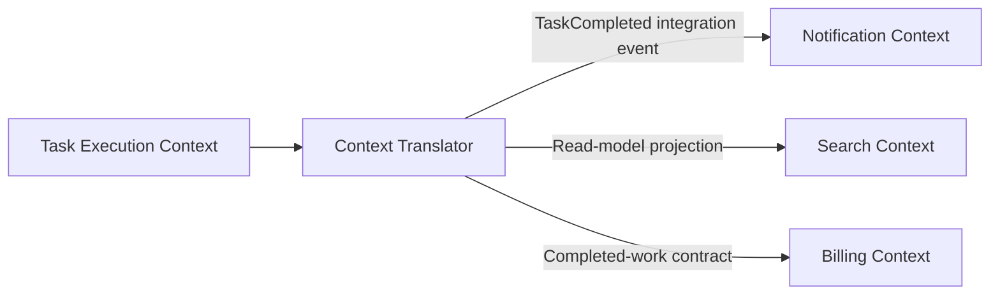

# 第十六章：DDD 基础——让模型表达业务决定

## `Task` 只是数据库表的一行吗

```ts
interface TaskRow {
  id: string;
  title: string;
  status: string;
  completed_at: string | null;
  assignee_id: string | null;
}
```

这个类型描述存储形状，却没有说明哪些状态合法、谁能完成任务、完成时间何时必须存在。业务规则散落在路由、SQL 和前端后，团队虽然都说“任务”，理解却可能不同。

## 先说人话：先统一业务语言

领域专家说“阻塞任务”“负责人”“截止日期”和“完成”，代码却使用 `flag2`、`owner_ref` 和通用 `updateStatus()`，沟通中的含义会不断丢失。

在代码、文档和讨论中使用同一套精确业务词汇，称为**通用语言（Ubiquitous Language）**。它不是做一张术语表就结束，而是让模型名称和规则随着业务理解一起修正。

**领域驱动设计（Domain-Driven Design, DDD）**关注复杂业务中，怎样让软件模型与业务语言、边界和不变量保持一致。它不是必须搭配微服务，也不是一套目录模板。

## Entity 与 Value Object

任务在标题变化后仍是同一个任务，因为它由稳定身份识别。这类有持续身份和生命周期的对象称为**实体（Entity）**。

```ts
interface Task {
  readonly id: TaskId;
  readonly title: TaskTitle;
  readonly state: TaskState;
}
```

`TaskTitle` 更关注值本身和规则，两个相同标题可以视为相等。这类由属性值定义、通常不可变的小概念称为**值对象（Value Object）**。

不要为每个字符串都创建类。只有当格式、单位、相等规则或不变量确实重要时，值对象才减少重复知识。

## Aggregate：谁负责维护跨对象不变量

假设任务有子任务，并规定“所有子任务完成后父任务才可完成”。如果任何代码都能单独写父任务状态，规则很容易被绕过。

把必须在同一一致性边界中维护的一组实体和值对象视为一个**聚合（Aggregate）**，并指定一个入口实体作为**聚合根（Aggregate Root）**。外部通过聚合根执行变化，而不是随意修改内部成员。

```ts
interface ParentTask {
  readonly task: Task;
  readonly children: readonly Task[];
}

function completeParent(parent: ParentTask): ParentTask {
  if (parent.children.some((child) => child.status !== "done")) {
    throw new TaskRuleError("仍有未完成的子任务");
  }
  return {
    ...parent,
    task: completeTask(parent.task, new Date().toISOString()),
  };
}
```

这是压缩后的函数式聚合示例：外部只把完整 `ParentTask` 交给迁移函数，子任务不能绕过该边界独立改写同一条完成不变量。真实实现还需要让持久化端口以同一一致性边界加载和保存它。聚合边界首先由强一致性规则决定，不由数据库外键数量决定；边界太大会造成并发冲突和加载成本。

## Bounded Context：同一个词可以有不同模型

在任务执行上下文中，“完成”表示状态迁移；在计费上下文中，它可能表示可结算工时；在搜索上下文中，只是索引字段。

一套模型和语言明确适用的范围称为**限界上下文（Bounded Context）**。跨上下文协作时需要翻译，而不是共享一个包含所有字段的超级 `Task` 类型。

当前小型 Task API 只有一个主要上下文，不需要先拆服务。但识别语言边界能防止未来把通知、身份、计费和搜索规则全部塞进任务模块。

## Domain Service 与 Application Service

无法自然属于单个实体、却仍是业务规则的操作，可以放在**领域服务（Domain Service）**中。协调 Repository、事务和外部调用的则属于应用用例或**应用服务（Application Service）**。

不要把所有逻辑都放进名为 `TaskDomainService` 的类。优先让规则靠近拥有数据和不变量的模型。

## 代价是什么

- 建模需要持续与业务人员沟通。
- 值对象和聚合会增加类型、映射和持久化复杂度。
- 边界划错后，跨聚合事务与查询会变困难。
- DDD 术语很多，容易变成命名表演。

DDD 的收益在复杂规则和长期演进中最明显，而不是普通 CRUD 的每个字段。

## 什么时候不需要

一个只保存标题、没有复杂规则的个人待办工具，使用简单数据类型和函数足够。不要为 `TaskId`、`TaskTitle`、`TaskCreatedAt` 各建一套类层次。

当难点主要是数据搬运而非业务规则，优先解决协议、验证和查询，而不是强行设计聚合。

## 请用自己的话解释

不要使用 DDD 术语，回答：

> 为什么数据库里同一张任务表，不代表通知、搜索和任务执行都应该共享完全相同的模型？

## 练习

1. **复述题**：解释稳定身份和值相等的区别。
2. **识别题**：列出 Task API 中三条必须始终成立的规则。
3. **实现题**：设计一个能拒绝空值和超长值的 `TaskTitle` 工厂函数。
4. **取舍题**：只有标题和完成状态的应用是否需要聚合根类？

## 上下文关系图



箭头上的数据需要明确翻译；每个上下文只保留完成自身决定需要的模型。

## 本章小结

- 通用语言让业务讨论、代码和测试使用同一含义。
- Entity 由身份延续，Value Object 由值和不变量定义。
- Aggregate 是强一致性边界，不是任意对象集合。
- Bounded Context 限定一套模型的适用范围；DDD 不要求微服务。

延伸阅读：[Martin Fowler：Bounded Context](https://martinfowler.com/bliki/BoundedContext.html)。
