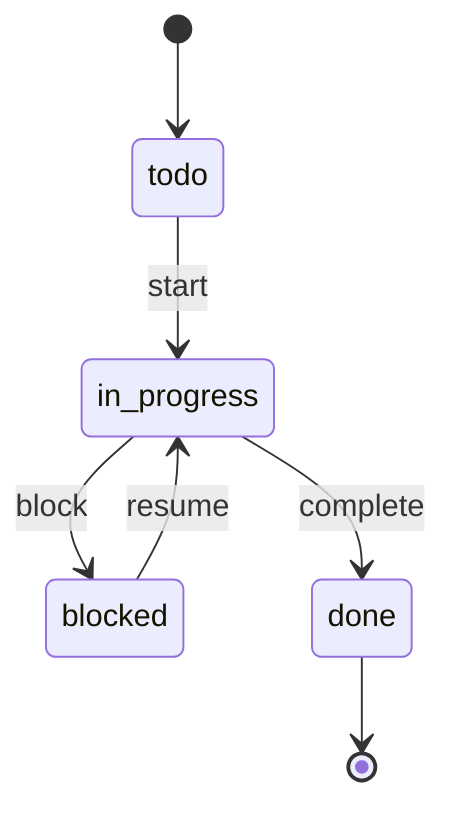
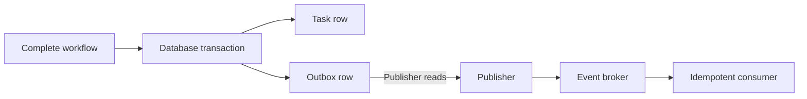

# 第十七章：状态机、工作流与事件驱动

## 状态只是一个可以随便更新的字符串吗

```ts
async function updateTaskStatus(taskId: string, status: string) {
  await database.run(
    "UPDATE tasks SET status = ? WHERE id = ?",
    status,
    taskId,
  );
}
```

任何调用者都能把 `done` 改回 `todo`，把 `canceled` 改成 `in_progress`，甚至写入 `banana`。SQL 更新成功不代表业务变化合法。

## 状态机：把允许的迁移写出来

**状态机（state machine）**由有限状态、事件和允许的迁移组成。它把散落的条件集中成可检查规则。

```ts
type TaskStatus = "todo" | "in_progress" | "blocked" | "done";

const transitions: Record<TaskStatus, readonly TaskStatus[]> = {
  todo: ["in_progress"],
  in_progress: ["blocked", "done"],
  blocked: ["in_progress"],
  done: [],
};

function canMove(from: TaskStatus, to: TaskStatus): boolean {
  return transitions[from].includes(to);
}
```

状态机的价值不是画漂亮图，而是让非法路径能被类型、代码和测试拒绝。

## 工作流：一次业务目标跨越多个步骤

完成任务可能需要：校验状态、保存、记录审计、发送事件。把这些有顺序、失败和恢复规则的步骤组织起来，称为**工作流（workflow）**。

下面省略 Repository、事务和 Outbox 的具体定义，只展示步骤顺序；`transitionTo()` 使用前面的迁移表校验目标状态：

```ts
async function completeTaskWorkflow(taskId: string) {
  const task = await repository.findById(taskId);
  const completed = transitionTo(task, "done");
  await transaction.run(async () => {
    await repository.save(completed);
    await outbox.add({ type: "task.completed", taskId });
  });
  return completed;
}
```

工作流拥有步骤顺序和失败边界；领域状态机拥有“能不能这样变”的规则。二者相关但不相同。

## 事件：已经发生的事实

`CompleteTaskCommand` 表示希望发生什么；`TaskCompleted` 表示领域中已经发生什么，因此它首先是**领域事件（domain event）**，名称通常使用过去式。需要跨进程发布时，应把它映射为版本化的**集成事件（integration event）**；两者可能暂时同形，但演化和兼容责任不同。

```ts
interface TaskCompleted {
  readonly type: "task.completed";
  readonly taskId: string;
  readonly occurredAt: string;
  readonly version: 1;
}
```

事件一旦发布，消费者可能保存或稍后处理，因此它成为兼容契约。随意改字段比修改内部函数风险更大。

## 事件驱动不等于“使用消息队列”

系统通过事件触发后续行为，并让发布者不必直接协调每个消费者，称为**事件驱动架构（event-driven architecture）**。事件可以在进程内分发，也可以经过消息代理。

消息队列增加跨进程可靠性和伸缩能力，同时引入重复投递、乱序、延迟、不可见调用链和运维成本。

## 数据保存与事件发布怎样保持一致

如果先保存任务再发布消息，进程可能在两步之间崩溃；任务已完成，事件却丢失。若先发消息再保存，消费者可能看见尚未提交的数据。

**Transactional Outbox** 的做法是：在同一数据库事务中保存业务数据和待发布事件，由独立发布器稍后发送。它不保证“恰好一次”，但能把丢失窗口变成可重试的记录。

消费者仍要使用事件 ID 或业务键实现幂等，因为大多数可靠传递采用至少一次投递。

## 编排与协同

- 中央协调者明确命令每一步，称为**编排（orchestration）**。
- 各参与者监听事件并自行反应，称为**协同（choreography）**。

编排容易看见全局流程，但协调者可能变大；协同降低直接认识，却会让整体流程分散。小型系统优先直接调用或显式工作流。

## 代价是什么

- 状态机需要维护迁移表和版本兼容。
- 异步事件带来最终一致性、重复和乱序。
- 分布式工作流很难得到跨服务原子事务。
- 事件过细会泄露内部实现，过粗又让消费者缺少信息。

## 什么时候不需要

`todo → done` 只有一条简单迁移时，一个纯函数已经足够。完成后只有一个必须同步执行的步骤时，直接调用比消息队列更容易理解失败。

不要把普通函数调用改名为事件，只为了“解耦”。只有多个生命周期独立的参与者、异步需求或可靠投递问题出现时，事件基础设施才可能值得。

## 请用自己的话解释

不要使用“状态机、工作流、事件驱动”，回答：

> 为什么数据库允许写入某个状态，并不能证明业务允许从当前状态跳过去？保存成功后通知又为什么可能丢失？

## 练习

1. **复述题**：区分“希望完成任务”和“任务已经完成”。
2. **识别题**：为 `todo/in_progress/blocked/done/canceled` 画允许迁移。
3. **实现题**：写非法迁移测试和重复事件消费测试。
4. **取舍题**：两个同步步骤是否需要消息队列？列出故障边界。

## 状态与事件流





## 本章小结

- 状态机集中允许状态和迁移，拒绝非法组合。
- 工作流拥有跨步骤顺序、失败和恢复。
- 命令表达意图，事件表达已经发生的事实。
- 事件驱动带来时间与部署解耦，也带来重复、乱序和最终一致性。
