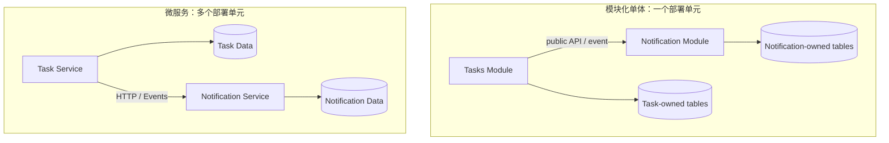

# 第十八章：单体、模块化单体与微服务

## 文件分开了，就已经是微服务吗

```text
task-service.ts
notification-service.ts
user-service.ts
```

这些文件仍在一个 Node.js 进程、一次部署和一个数据库中。名称带 `service` 不会改变运行边界。

本章的问题是：

> 什么时候应该把模块放在同一部署单元，什么时候值得让它们通过网络独立运行？

## 单体：一起构建和部署的应用

一个应用的主要模块作为一个部署单元发布，通常称为**单体（monolith）**。它可以有清晰模块，也可以是混乱的大泥球；“单体”描述部署形状，不自动评价代码质量。

单体的优势包括：

- 本地调用直接，调试链路短；
- 单数据库事务容易；
- 部署、版本和测试环境较少；
- 小团队更容易整体修改。

它的风险是模块边界若不清楚，所有代码会逐渐互相 import，最后任何修改都需要全系统验证。

## 模块化单体：先在一个进程内建立真实边界

**模块化单体（modular monolith）**仍一起部署，但内部模块有明确所有权、公开接口和依赖规则。

```text
tasks/
  public.ts
  domain/
  application/
notifications/
  public.ts
  application/
composition/
```

任务模块不允许直接读取通知模块内部表；跨模块通过公开用例或事件协作。这样可以保留单体运行简单性，同时降低变化传播。

当前课程 Task API 就选择这种方向，但因为规模很小，没有先创建多个顶层业务模块。

## 微服务：独立部署与数据所有权

把系统按业务能力拆成可独立部署、通过网络协作的服务，称为**微服务（microservices）**。

独立部署可能带来：

- 不同团队按自己的节奏发布；
- 某个热点服务单独扩容；
- 故障和技术选择有机会隔离。

但网络边界也立即带来：

- 超时、重试、限流和熔断；
- 分布式追踪和跨服务调试；
- 数据一致性与重复消息；
- API 版本与多服务部署协调；
- 更多运行环境、权限和成本。

如果团队不能独立拥有、部署和运维服务，微服务的边界通常只会把模块调用变成更慢、更不可靠的网络调用。

## 数据库是否共享

真正独立的服务通常拥有自己的数据模型和迁移。多个服务直接读写同一张表，会让数据库成为隐藏共享接口，一方改 Schema 就可能破坏另一方。

但“每个服务一台数据库服务器”不是必要条件。关键是数据所有权和写入边界清楚，基础设施可以共享集群。

跨服务查询常用 API 聚合、读模型或事件复制解决，这些方案都引入一致性与运维成本。

## 怎样判断是否值得拆

至少观察以下证据：

1. 业务边界和语言已经稳定。
2. 团队需要独立发布且当前协调确实成为瓶颈。
3. 负载、合规或故障隔离要求明显不同。
4. 团队有自动化部署、监控和故障处理能力。
5. 能接受跨边界数据不再使用普通本地事务。

Martin Fowler 的“Monolith First”建议提醒我们：业务边界尚未理解时，先在单体中探索，通常比过早固定网络边界更容易修正。

## 代价是什么

单体可能需要整体部署和扩容；微服务则把复杂度移到网络、数据和运维。模块化单体要求团队主动维护内部边界，否则容易退化。

没有一种形状永远最好。架构是在开发速度、运行可靠性、团队自治和认知负担之间分配成本。

## 什么时候不需要微服务

一个小团队、一个 Task API、少量请求和一个清晰数据库，没有独立发布压力时，模块化单体更合适。

不要因为未来可能有百万用户就提前拆服务。性能瓶颈可以先测量、优化查询、增加缓存或垂直/水平扩展单体。网络边界应由当前证据推动。

## 请用自己的话解释

不要使用“单体”和“微服务”，回答：

> 为什么把两个文件部署成两个进程，会同时得到独立发布能力和新的失败方式？

## 练习

1. **复述题**：区分源码模块边界和部署边界。
2. **识别题**：找出一个“名为服务但仍共享所有内部表”的模块。
3. **设计题**：为任务和通知画模块化单体的公开协作接口。
4. **取舍题**：列出拆分通知服务前必须出现的三个证据。

## 部署形状对比



## 本章小结

- 单体描述共同部署，不等于代码必然混乱。
- 模块化单体在一个进程内维护真实业务边界。
- 微服务用网络和独立数据所有权换取部署、扩容和团队自治。
- 在业务边界和运维能力成熟前，先把单体模块化通常更容易修正。

延伸阅读：[Martin Fowler：Monolith First](https://martinfowler.com/bliki/MonolithFirst.html)、[Microservices](https://martinfowler.com/articles/microservices.html)。
