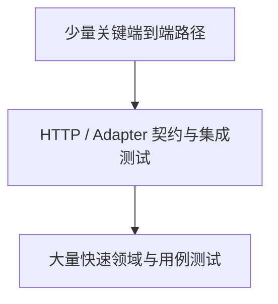

# 第十九章：测试策略——用不同证据覆盖不同风险

## 测试全绿，为什么上线仍然失败

```ts
it("creates a task", async () => {
  const repository = new InMemoryTaskRepository();
  const execute = makeCreateTask({ repository, newId, now });
  expect((await execute({ title: "学习架构" })).status).toBe("todo");
});
```

这个测试能证明领域和应用协调，却不能证明 HTTP JSON 能解析、SQLite Schema 正确或生产配置有效。测试全绿只说明被测试的范围通过了。

本章的问题是：

> 怎样根据失败风险选择测试层次，而不是把所有测试都写成同一种？

## 先说人话：每类测试回答一个问题

- 纯领域测试：规则对输入的结果是否正确？
- 应用用例测试：步骤和副作用是否正确协调？
- 适配器集成测试：代码是否真的兼容数据库、文件或外部 API？
- HTTP 测试：协议、状态码、Schema 和错误结构是否正确？
- 端到端测试：从真实入口到真实关键依赖的用户路径能否完成？

把这些证据按速度、隔离程度和真实程度组合起来，称为**测试策略（test strategy）**。

## 测试金字塔不是配额

常见**测试金字塔（test pyramid）**建议底部有较多快速、局部测试，上层保留较少但真实的端到端测试。它不是规定 70/20/10 的固定比例，而是避免全部依赖缓慢、易碎的大型测试。

当前 Task API 的 18 个测试主要覆盖领域、用例、路由和 HTTP server 边界。加入 SQLite 后，还必须增加真实数据库集成测试；否则内存 Repository 可能掩盖 SQL、事务和迁移错误。

## 最小改进：先按风险补一层证据

| 风险 | 最合适的首要证据 |
| --- | --- |
| 空标题被接受 | 领域单元测试 |
| 用例忘记保存 | 应用协调测试 |
| SQLite 查询映射错误 | Repository 集成测试 |
| 400 错误结构变化 | HTTP/契约测试 |
| 服务启动后主流程不可用 | 冒烟或端到端测试 |

一个高价值测试失败时，应该能告诉我们哪类契约被破坏，而不只是“系统某处不对”。

## 契约测试保护替换关系

多个 Repository 实现应运行同一组行为测试：

```ts
interface RepositoryFixture {
  readonly repository: TaskRepository;
  readonly close: () => Promise<void>;
}

export function taskRepositoryContract(
  createFixture: () => Promise<RepositoryFixture>,
) {
  it("returns undefined for a missing task", async () => {
    const fixture = await createFixture();
    try {
      expect(await fixture.repository.findById("missing")).toBeUndefined();
    } finally {
      await fixture.close();
    }
  });
}
```

内存和 SQLite 都通过这组测试，说明它们遵守共同的可观察约定。契约测试不能证明性能和事务保证相同，因此这些差异仍要单独记录。

## 测试替身怎样选

- **Stub** 提供预设返回值。
- **Fake** 是简化但可工作的实现，例如内存 Repository。
- **Spy/Mock** 记录调用或验证交互。

不要把术语当等级。需要验证保存后的查询行为时，Fake 很合适；只想证明发送了一次审计命令时，Spy 更直接。过多 Mock 会把测试绑在调用顺序和私有结构上。

## 失败路径和竞态同样需要证据

领域、适配器和接口测试应按风险覆盖非法输入、不存在、依赖失败、超时、重复请求和并发版本冲突。进程重启、备份恢复和区域故障属于系统级或发布演练，不要求每个小模块各自模拟。成功路径测试最多只能证明“天气晴朗时能走通”。

对计时和并发代码，优先注入时钟、使用可控 Promise 或真实集成环境；不要依赖随意 `sleep` 让竞态“可能发生”。

## 代价是什么

- 测试增加执行和维护时间。
- 集成环境需要数据清理和稳定依赖。
- 端到端测试失败定位较慢。
- 追求覆盖率数字可能产生没有断言价值的测试。

覆盖率可以发现没执行到的区域，不能证明断言正确或风险已覆盖。

## 什么时候不需要每层都有测试

一个纯函数不需要 HTTP 端到端测试来证明数学结果。一个没有数据库的模块不需要制造数据库集成层。

小型项目可以先保护最重要规则和入口，随着外部依赖与故障成本增长再扩展层次。不要为了画出漂亮金字塔创建空洞测试。

## 请用自己的话解释

不要使用测试层次名称，回答：

> 为什么内存 Repository 测试通过，仍然不能证明 SQLite 的 SQL 和迁移正确？

## 练习

1. **复述题**：为领域、应用、数据库和 HTTP 各写一个它独有的问题。
2. **识别题**：判断一个失败只显示“500”的 E2E 测试缺少哪些更局部证据。
3. **实现题**：为两个 Repository 实现设计共同契约测试。
4. **取舍题**：一个纯字符串函数是否需要浏览器 E2E？

## 测试组合



## 本章小结

- 测试策略按风险选择证据，不按固定比例填满层次。
- 局部测试快且易定位，集成和端到端测试提供真实边界证据。
- 契约测试保护多个实现的共同承诺。
- 成功、失败、超时、重复和竞态都属于架构行为。

延伸阅读：[Node.js test runner](https://nodejs.org/api/test.html)、[Martin Fowler：The Practical Test Pyramid](https://martinfowler.com/articles/practical-test-pyramid.html)。
