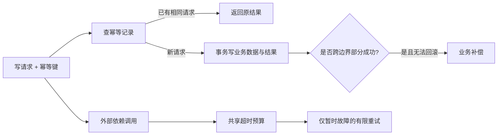

# 第二十章：错误、超时、重试、幂等与补偿

## `catch` 以后再试一次，为什么可能创建两个任务

```ts
async function createTaskWithRetry(input: CreateTaskInput) {
  try {
    return await api.createTask(input);
  } catch {
    return api.createTask(input);
  }
}
```

第一次请求可能已经在服务器保存成功，只是响应在网络中丢失。客户端重试后，系统可能创建第二个任务。重试解决了暂时失败，却制造了重复副作用。

## 先给错误分类

- **业务错误**：空标题、非法状态迁移；调用者可根据规则修正。
- **不存在/冲突**：任务不存在、版本已过期；通常映射为稳定状态码。
- **暂时故障**：网络抖动、限流、依赖短暂不可用；可能适合重试。
- **永久故障**：认证失败、Schema 不兼容；重试不会自动变好。
- **编程错误**：不变量被破坏、未处理分支；应暴露给监控并修复。

把所有异常都返回 400 或全部重试，会丢失错误所有权。

## 超时：调用者的耐心需要边界

没有超时的外部请求可能永久占用连接和内存。Node.js 可以用 `AbortSignal.timeout()` 给请求设置期限：

```ts
async function fetchProfile(userId: string) {
  const url = new URL(`/users/${userId}`, config.userApiBaseUrl);
  const response = await fetch(url, {
    signal: AbortSignal.timeout(2_000),
  });
  if (!response.ok) throw new Error(`profile failed: ${response.status}`);
  return response.json() as Promise<unknown>;
}
```

两秒不是宇宙真理。超时应来自用户体验、依赖 SLO 和调用链预算。上游剩余 500ms 时，下游不应再等待 2s。

## 重试：只对可能恢复的操作

安全重试至少要回答：

1. 失败是否暂时？
2. 操作是否无副作用或幂等？
3. 最大次数和总时间是多少？
4. 是否使用指数退避与随机抖动，避免所有客户端同时重试？

```ts
async function retryRead(signal: AbortSignal) {
  for (let attempt = 1; attempt <= 3; attempt += 1) {
    signal.throwIfAborted();
    try {
      return await readFromDependency(signal);
    } catch (error: unknown) {
      if (!isTransient(error) || attempt === 3) throw error;
      await delay(withJitter(100 * 2 ** (attempt - 1)), signal);
    }
  }
  throw new Error("unreachable");
}
```

这里省略 `delay` 的具体定时器清理，但它必须监听同一个取消信号；整个循环还应受总 deadline 约束，而不是每次尝试重新获得完整预算。

下面这种没有错误分类、次数和取消边界的循环则不安全：

```ts
for (let attempt = 1; ; attempt += 1) {
  try {
    return await readFromDependency();
  } catch (error: unknown) {
    console.warn("retrying", attempt, error);
  }
}
```

## 幂等：重复执行得到同一业务效果

一次操作执行多次，业务结果与执行一次相同，称为**幂等（idempotency）**。HTTP 方法语义可以提供线索，但业务副作用仍要自行保证。

创建任务可要求客户端发送幂等键：

```text
Idempotency-Key: 550e8400-e29b-41d4-a716-446655440000
```

服务器在同一事务中保存“调用者 + 幂等键 + 请求摘要 + 结果”。重复键且请求相同就返回原结果；同键不同请求应报冲突。记录还需要过期策略和并发唯一约束。

## 乐观并发：不要悄悄覆盖别人的修改

`PATCH /tasks/:id` 可以带版本号或 `If-Match`。数据库更新时要求当前版本仍相同：

```sql
UPDATE tasks
SET title = $1, version = version + 1
WHERE id = $2 AND version = $3;
```

更新行数为 0 表示任务不存在或版本冲突，调用者需要重新读取和决策。这称为**乐观并发控制（optimistic concurrency control）**。

## 补偿不是数据库回滚

跨服务流程通常无法用一个本地事务回滚。支付成功后创建任务失败，可能需要发起退款或记录人工处理。这种通过新的业务动作抵消先前动作的做法称为**补偿（compensation）**。

补偿也会失败，所以工作流必须保存状态、支持重试和人工介入。它不是让世界恢复到“从未发生”，审计痕迹仍然存在。

## 代价是什么

- 超时过短产生误失败，过长消耗资源。
- 重试会放大依赖压力。
- 幂等记录需要存储、唯一约束和清理。
- 补偿流程会增加中间状态与运营工具。

可靠性机制也会互相影响：超时后重试要求幂等，异步重试要求可观察，补偿要求审计。

## 什么时候不需要

纯读取本地内存通常不需要复杂重试。一个可由数据库本地事务完成的操作，不应先设计分布式补偿。

内部低价值操作如果失败可以直接由用户重新执行，也许只需要明确错误和有限超时。不要把所有函数都套三次重试。

## 请用自己的话解释

不要使用“幂等”和“补偿”，回答：

> 为什么第一次创建任务响应丢失后，客户端重试可能创建重复数据？服务器怎样识别“这是同一次意图”？

## 练习

1. **复述题**：区分暂时故障、永久故障和业务错误。
2. **识别题**：找出一个无上限重试或无超时请求。
3. **设计题**：为 `POST /tasks` 定义幂等键重复、冲突和过期行为。
4. **取舍题**：本地纯函数失败是否应该重试？

## 可靠调用流



## 本章小结

- 先分类错误，再决定映射、重试或报警。
- 超时限定资源占用和等待边界。
- 重试必须有上限，并只针对可能恢复且可安全重复的操作。
- 幂等键、版本控制和补偿分别处理重复、并发覆盖和跨边界部分成功。

延伸阅读：[Node.js AbortSignal](https://nodejs.org/api/globals.html)、[Undici Fetch](https://undici.nodejs.org/api/Fetch)。
