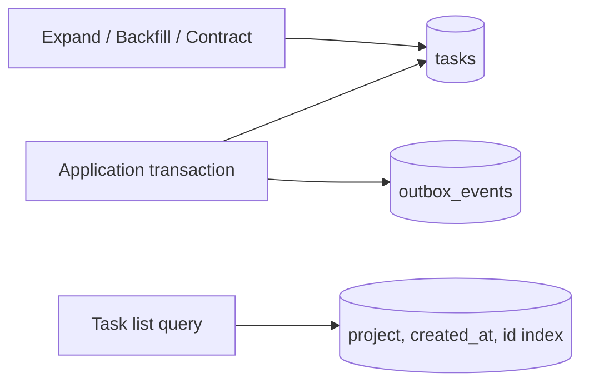

# 第二十一章：数据库、事务、索引与迁移

## Repository 隐藏了 SQL，数据库问题就消失了吗

```ts
interface TaskRepository {
  save(task: Task): Promise<void>;
  findById(id: string): Promise<Task | undefined>;
}
```

这个端口隔离了驱动细节，但没有回答并发更新是否丢失、查询是否使用索引、迁移失败怎样恢复。抽象能限制知识传播，不能取消数据库的物理规律。

## 事务：一组变化作为一个提交边界

完成任务并写 Outbox 事件必须一起成功或一起失败：

```sql
BEGIN;

WITH completed AS (
  UPDATE tasks
  SET status = 'done', completed_at = CURRENT_TIMESTAMP
  WHERE id = $1 AND status <> 'done'
  RETURNING id
)
INSERT INTO outbox_events(id, type, aggregate_id, payload)
SELECT $2, 'task.completed', id, $3 FROM completed;

COMMIT;
```

如果任务不存在或已经完成，`completed` 没有行，也不会写出虚假事件。调用者还必须检查影响行数，区分不存在与重复完成；`outbox_events.id` 应有唯一约束，使同一业务尝试不会插入重复事件。这组操作的原子提交范围称为**事务（transaction）**。事务还涉及一致性、隔离和持久性，但这些性质依赖具体数据库与隔离级别，不能只靠 `BEGIN/COMMIT` 名称推断。

## 隔离级别在防什么

两个请求同时读取和更新数据，可能产生脏读、不可重复读、幻读或写覆盖。数据库通过锁、多版本并发控制和**事务隔离级别（transaction isolation level）**管理这些现象。

PostgreSQL 的 Read Committed 是常见默认级别，但“已提交”不等于整个事务内多次读取完全不变。需要严格不变量时，可以使用条件更新、行锁或更高隔离级别，并处理序列化失败重试。

不要全局把隔离级别调到最高来逃避建模；更强隔离通常带来等待、冲突和吞吐成本。

## 索引：用写入和空间换读取路径

任务列表常按项目和创建时间查询：

```sql
SELECT id, title, status, created_at
FROM tasks
WHERE project_id = $1
ORDER BY created_at DESC, id DESC
LIMIT 50;
```

可考虑匹配过滤和排序的复合索引：

```sql
CREATE INDEX tasks_project_created_idx
ON tasks(project_id, created_at DESC, id DESC);
```

**索引（index）**是数据库维护的额外查找结构。它能减少扫描，却增加写入、存储和迁移成本。索引设计必须结合真实查询计划和数据分布，而不是给每列都加索引。

## 分页为什么优先 cursor

`OFFSET 100000` 仍可能要求数据库扫描并丢弃大量记录，而且并发插入会导致重复或漏项。基于上一页 `(created_at, id)` 的**游标分页（cursor pagination）**更适合稳定的大列表：

```sql
SELECT id, title, status, created_at
FROM tasks
WHERE project_id = $1
  AND (created_at, id) < ($2, $3)
ORDER BY created_at DESC, id DESC
LIMIT 50;
```

这里的游标保存上一页最后一行的时间和 ID，并与降序方向一致。时间戳可能相同，所以需要唯一 ID 作为补充键；它不适合用户随机跳到第 500 页。选择分页方式也是产品体验和查询成本的取舍。

## 迁移：Schema 变化必须跨版本安全

部署新代码和修改数据库很难绝对同时发生。安全迁移常使用 expand/contract：

1. 先增加兼容的新列或表。
2. 部署能同时读写旧、新结构的代码。
3. 回填数据并验证。
4. 切换读取。
5. 确认旧版本不再运行后删除旧结构。

```sql
ALTER TABLE tasks ADD COLUMN priority text;
```

新增可空列通常比立即增加非空且无默认值的列更容易兼容。具体锁表行为仍需查数据库版本文档并在相似数据量上演练。

## Repository 的边界在哪里

Repository 可以隐藏 SQL 方言和行映射，但事务边界通常属于应用工作流。若一次用例要同时保存 Task 与 Outbox，应用需要一个能在同一事务上下文调用二者的能力，而不是让两个 Repository 各自偷偷提交。

复杂报表也不必强行经过聚合 Repository；专用查询对象或读模型可以更诚实地表达 JOIN、分页和投影。

## 代价是什么

- 事务越大，锁持有和冲突越多。
- 索引越多，写入和迁移越慢。
- 双写兼容代码会暂时增加复杂度。
- 数据回填需要限速、监控、重试和校验。

## 什么时候不需要

十条本地数据的教学脚本不需要游标分页和在线迁移。内存示例也不应假装具备数据库事务保证。

但一旦生产数据不可轻易重建，迁移与恢复就不是“运维以后再说”，而是数据边界的一部分。

## 请用自己的话解释

不要使用“事务”和“索引”，回答：

> 为什么“任务已完成但事件没记录”是一个一致性问题？为什么给所有字段加查找结构也不是免费的？

## 练习

1. **复述题**：解释一次提交边界保护什么。
2. **识别题**：为任务列表 SQL 画出过滤、排序和分页字段。
3. **设计题**：把新增必填 `priority` 拆成可回滚的迁移步骤。
4. **取舍题**：只有 100 条本地数据时是否需要 cursor 分页？

## 数据变化流



## 本章小结

- Repository 隔离驱动，不会消除事务、查询和迁移问题。
- 事务定义一致提交边界，隔离级别决定并发可见性和冲突。
- 索引用写入与空间成本换取特定查询路径。
- 迁移必须考虑旧代码、新代码和真实数据同时存在的窗口。

延伸阅读：[PostgreSQL 事务隔离](https://www.postgresql.org/docs/current/transaction-iso.html)、[CREATE INDEX](https://www.postgresql.org/docs/current/sql-createindex.html)、[SQLite Transactions](https://sqlite.org/lang_transaction.html)。
