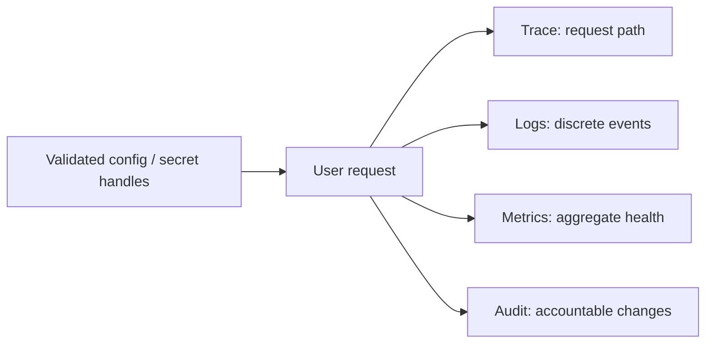

# 第二十二章：配置、密钥、日志、指标、追踪与审计

## 系统出错时，`console.log("failed")` 为什么不够

```ts
try {
  await createTask(input);
} catch (error: unknown) {
  console.log("failed", error);
  throw error;
}
```

它没有请求 ID、任务 ID、耗时、环境或错误分类；还可能把用户数据和密钥完整输出。单机开发时能看见，不代表生产环境能检索、关联和安全保存。

## 配置是外部输入

端口、数据库地址、日志级别和超时时间随部署环境变化，属于**配置（configuration）**。它们应在启动边界一次读取、校验并形成不可变对象：

```ts
interface AppConfig {
  readonly port: number;
  readonly logLevel: "debug" | "info" | "warn" | "error";
}

function readConfig(env: NodeJS.ProcessEnv): AppConfig {
  return {
    port: parsePort(env.PORT),
    logLevel: parseLogLevel(env.LOG_LEVEL),
  };
}

const config = readConfig(process.env);
```

`parsePort` 与 `parseLogLevel` 对缺失或非法值返回明确启动错误，进程在接收流量前失败。不要让每个业务函数自己读取 `process.env`。那会隐藏依赖，也会让一次进程运行中的配置含义不稳定。

## 密钥不是普通配置文本

数据库密码、API Key 和签名私钥属于**密钥（secret）**。它们需要专门存储、最小权限、轮换和审计，不能提交进 Git、写入镜像或输出日志。

应用应接收密钥值或访问句柄，不应知道团队具体使用哪个云密钥产品。读取失败应在启动时明确失败，而不是等第一个用户请求才发现。

## 日志：记录离散事件

**日志（log）**适合记录“某件事在某时发生”，并带结构化字段：

```ts
logger.info("task created", {
  requestId,
  taskId: task.id,
  durationMs,
});
```

字段要稳定、可查询；消息不能包含密码、令牌或不必要的个人数据。错误只在拥有处理或请求边界的一层记录一次，避免每层重复打印同一个堆栈。

## 指标：回答系统整体怎样

**指标（metric）**是可聚合数值，例如请求率、错误率、延迟分布和队列深度。它适合报警和趋势，不适合记录每个任务标题。

标签维度必须有界。把 `taskId` 或完整 URL 当标签会产生高基数，拖垮监控系统。任务 ID 更适合日志或追踪属性。

Google SRE 常用“延迟、流量、错误、饱和度”观察面向用户的服务信号。实际选择仍要围绕本系统的用户结果。

## 追踪：连接一次请求的跨边界步骤

**分布式追踪（distributed tracing）**用 trace/span 连接一次请求经过的 HTTP、数据库和外部服务。它能回答“慢在哪里”，但需要上下文传播和统一采样。

```text
trace task-create
├─ HTTP POST /tasks
├─ application createTask
└─ repository INSERT tasks
```

OpenTelemetry 提供日志、指标和追踪的开放语义与导出协议。采用它不代表自动获得好观测；Span 名称、属性、采样和告警仍需设计。

## 审计：谁在什么时候改变了什么

**审计日志（audit log）**服务于安全、合规和业务追责，与调试日志不同。它通常记录操作者、动作、对象、时间、前后版本和请求来源，并要求防篡改、受控访问和保留策略。

```ts
interface AuditEntry {
  readonly actorId: string;
  readonly action: "task.completed";
  readonly taskId: string;
  readonly occurredAt: string;
  readonly requestId: string;
  readonly beforeVersion: number;
  readonly afterVersion: number;
  readonly sourceIp?: string;
}
```

敏感来源字段只在规则要求时记录，并受访问与保留控制。调低应用日志级别不应让审计记录消失；删除普通日志也不应破坏合规保留。审计写入失败是阻止业务操作还是进入可靠补写队列，也必须由合规要求明确。

## 代价是什么

- 遥测会消耗 CPU、网络和存储。
- 采样可能错过个别请求，全部保留又可能太贵。
- 字段过多会泄露隐私或制造高基数。
- 审计不可变要求更严格的写入与访问控制。

先定义要回答的故障问题，再采集最小必要信号。

## 什么时候不需要全套平台

本地 CLI 可能只需要清晰错误输出。单进程开发环境不必先部署完整追踪后端。

但配置校验、密钥不入库和稳定错误字段是低成本基础。系统一旦需要值班和故障恢复，日志、指标和关键请求追踪就不再是装饰。

## 请用自己的话解释

不要使用四种遥测名称，回答：

> 想知道“整体错误率是否升高”“某次请求为何失败”“谁完成了任务”，分别需要什么不同证据？

## 练习

1. **复述题**：解释配置为什么也属于不可信输入。
2. **识别题**：找出日志中的密码、令牌和高基数字段。
3. **设计题**：为创建任务定义三条日志字段、两个指标和一个 trace 结构。
4. **取舍题**：本地脚本是否需要分布式追踪平台？

## 信号关系



## 本章小结

- 配置和密钥在启动边界读取，密钥需要独立保护与轮换。
- 日志记录事件，指标观察整体，追踪连接调用路径，审计保存责任事实。
- 遥测字段、基数、采样、隐私和保留都有成本。
- 可观测性的目标是回答运行问题并支持恢复，不是收集越多越好。

延伸阅读：[OpenTelemetry Logs](https://opentelemetry.io/docs/concepts/signals/logs/)、[Google SRE Monitoring](https://sre.google/sre-book/monitoring/)。
