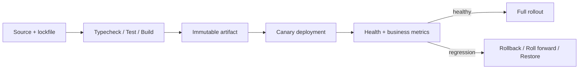

# 第二十三章：构建、部署、版本、兼容与恢复

## 本机能运行，为什么发布后启动失败

```json
{
  "scripts": {
    "build": "tsc",
    "start": "node dist/main.js"
  }
}
```

如果构建没有锁定 Node 版本、依赖、环境变量和产物内容，开发机成功不能证明生产环境得到同一个程序。架构最终必须落到可重复交付和可恢复运行。

## 构建：把源码变成可验证产物

**构建（build）**应尽量从锁定的源码和依赖生成可重复产物：

```text
npm ci
→ typecheck
→ test
→ tsc build
→ package immutable artifact
```

`npm ci` 根据 lockfile 安装，避免发布时悄悄解析新依赖。构建环境应固定 Node 主版本；教材示例声明 Node.js 22 及以上，但真实生产通常还会固定镜像和补丁更新策略。

不要在生产机器临时编译一份无人验证的源码。部署的对象应是已经通过门禁的同一产物。

## 多阶段镜像减少运行面

下面只展示阶段关系。为便于阅读使用可变 tag；生产必须固定经过审核的镜像 digest，并生成 SBOM、执行漏洞扫描和签名验证：

```dockerfile
FROM node:22 AS build
WORKDIR /app
COPY package*.json ./
RUN npm ci
COPY . .
RUN npm run build && npm test
RUN npm prune --omit=dev

FROM node:22-slim AS runtime
WORKDIR /app
ENV NODE_ENV=production
COPY --from=build /app/node_modules ./node_modules
COPY --from=build /app/dist ./dist
USER node
CMD ["node", "dist/main.js"]
```

**多阶段构建（multi-stage build）**让编译工具留在构建阶段，运行镜像保留构建产物和生产依赖。示例已使用非 root 用户，但健康检查、只读文件系统、镜像摘要和平台安全策略仍需按真实服务补齐，不能把它直接当完整生产基线。若应用确认没有任何运行时第三方依赖，才可以省略 `node_modules`。

## 部署：改变运行环境中的版本

常见策略包括：

- Rolling：逐批替换实例，资源成本低，但新旧版本会短暂共存。
- Blue/Green：准备完整新环境后切流，回退快但资源较多。
- Canary：先给小比例流量，观察关键指标后逐步扩大。

无论策略名称如何，都要定义健康检查、就绪检查、停止接收流量、优雅关闭和超时。进程收到停止信号后，应停止接新请求、等待有界时间内的在途请求并关闭连接。

## 版本与兼容

版本不仅是 `package.json` 数字，还包括 HTTP API、事件、数据库 Schema 和配置。

兼容变更通常先增加可选字段；删除或改变含义则需要迁移窗口。新服务发布时，旧客户端和旧事件可能仍存在，所以读取方应采用**宽容读取、明确写入**：只依赖承诺字段，写出严格版本化结构，但不能静默接受安全敏感的未知字段。

语义化版本适合公开包的兼容沟通，却不能自动决定分布式系统是否安全部署。部署矩阵和契约测试更直接。

## 恢复：回滚不一定够

代码可以回滚，数据库删除列和外部副作用却不一定可逆。安全发布需要区分：

- **回滚（rollback）**：重新部署旧代码或旧配置。
- **前滚修复（roll forward）**：发布新版本修复已改变的数据/Schema。
- **数据恢复（restore）**：从备份和日志恢复到某一时点。
- **降级（degrade）**：暂时关闭非核心功能保住主流程。

备份只有经过恢复演练才是证据。还要定义 RPO（最多可接受丢失多少数据）和 RTO（最多可接受恢复多久）。

## 发布门禁与停止条件

一次发布至少应观察错误率、延迟、饱和度和核心业务成功率。Canary 指标恶化时要有自动或人工停止条件，而不是“再观察一下”。

发布记录应能回答：谁部署了哪个不可变产物、使用什么配置、迁移到哪个 Schema 版本、怎样回退。

## 代价是什么

- 多环境和 Canary 增加基础设施成本。
- 兼容代码在迁移窗口内会重复。
- 优雅关闭和回滚脚本需要演练。
- 更严格门禁可能降低发布速度，但减少不可恢复变更。

自动化不是越多越安全；错误的自动回滚可能在数据库已经不兼容时放大故障。

## 什么时候不需要复杂发布平台

个人本地项目可以用一个进程和手动启动。低流量内部工具未必需要 Blue/Green 集群。

但 lockfile、构建测试、启动说明和数据备份仍然值得。只要数据重要，就应该实际验证恢复，而不是等故障发生再读备份文档。

## 请用自己的话解释

不要使用“CI/CD、Canary、RPO、RTO”，回答：

> 为什么应该部署已经测试过的同一份产物？为什么代码回退不能自动恢复已经删除的数据库列？

## 练习

1. **复述题**：区分构建产物、运行配置和数据库版本。
2. **识别题**：找出一个部署中新旧版本会同时运行的兼容风险。
3. **设计题**：为 Task API 写 Canary 停止条件和回退步骤。
4. **取舍题**：个人项目是否需要 Kubernetes？哪些更小的交付保障仍需要？

## 交付与恢复流



## 本章小结

- 构建把源码和锁定依赖变成通过验证的不可变产物。
- 部署策略必须处理新旧版本共存、健康检查和优雅关闭。
- API、事件、Schema 和配置都有版本兼容窗口。
- 回滚、前滚、恢复和降级是不同工具；备份必须经过恢复演练。

延伸阅读：[Docker Multi-stage builds](https://docs.docker.com/build/building/multi-stage/)、[AWS：自动测试与回滚](https://docs.aws.amazon.com/wellarchitected/latest/framework/ops06_mit_deploy_risks_auto_testing_and_rollback.html)。
