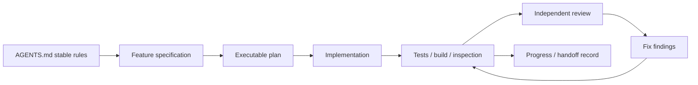

# 第二十四章：AI 上下文、规格、计划与 AGENTS.md

## 为什么同一个 Agent 有时写得很好，有时完全跑偏

```text
提示 A：给任务 API 加重试。

提示 B：读取架构文档；只对用户资料查询的暂时网络错误重试；
写请求不得自动重试，除非带幂等键；总预算 2 秒；最多 2 次；
补失败路径测试；不引入新依赖。
```

提示 A 没有告诉 Agent 重试什么、风险是什么、怎样算完成。模型只能用常见经验填空，而这些猜测可能与项目边界冲突。

本章的问题是：

> 怎样把长期规则、当前需求和执行步骤分层提供给 AI，让它能行动，又不靠一次超长提示塞进全部仓库？

## 上下文工程：决定模型此刻能看见什么

给模型选择、组织和更新必要信息的工作，可称为**上下文工程（context engineering）**。它不只是“写一个聪明 Prompt”，还包括：

- 稳定的仓库规则；
- 当前功能规格；
- 可执行计划；
- 相关代码与测试；
- 最近验证和失败结果；
- 明确不在范围内的内容。

上下文越多不一定越好。无关日志、过期计划和整份依赖源码会稀释真正约束。目标是提供足够证据，并让 Agent 能按需定位更多内容。

## 三层信息各自放在哪里

### 仓库级规则

适合放进 `AGENTS.md`：目录地图、构建命令、代码风格、安全限制、文档流程和完成定义。这些规则跨多个任务稳定存在。

```md
# AGENTS.md

- Runtime: Node.js 22+, TypeScript ESM.
- Run: npm run typecheck && npm test && npm run build.
- Treat HTTP, env and file data as unknown until validated.
- Domain code must not import HTTP or database adapters.
- Use apply_patch for semantic edits; preserve unrelated changes.
- A task is complete only after tests and docs are synchronized.
```

不要把一次功能的具体字段和临时调试记录永久写进 `AGENTS.md`，否则稳定规则会变成垃圾堆。

### 功能规格

**规格（specification）**描述要实现什么、为什么、边界和验收标准。它应让两个人独立实现后仍大体得到同一行为。

```text
Goal: POST /tasks 支持幂等创建。
Input: Idempotency-Key 必填，1—128 字符。
Behavior: 同键同请求返回原 201 结果；同键不同请求返回 409。
Failure: 存储失败不留下半条幂等记录。
Non-goal: 不实现跨区域复制。
Acceptance: 契约测试覆盖首次、重放、冲突和并发。
```

规格不是“使用 Redis 做幂等”这样的预设实现，除非技术选择本身已经批准。

### 实施计划

**计划（plan）**把规格映射到文件、接口、测试顺序和验证命令。它回答“怎样安全地到达”，不是重复需求。

```text
1. 为幂等行为写失败的 HTTP 契约测试。
2. 定义 IdempotencyStore 端口和冲突结果。
3. 在应用事务中保存任务与幂等结果。
4. 映射 201 replay 与 409 conflict。
5. 运行 focused test、typecheck、full test、build。
6. 更新 API 文档和开发记录。
```

## 规格必须可验证

“代码优雅”“性能好”“错误处理完善”无法直接验收。改写成可观察行为：

- 95% 请求在目标环境低于 200ms；
- 依赖超时返回稳定错误码；
- 相同幂等键并发请求只创建一条任务；
- `npm run typecheck/test/build` 通过；
- 领域目录不 import `node:http`。

AI 会把模糊词填成自己的理解；可验证标准把裁决权交回证据。

## 上下文预算与渐进读取

先给 Agent 项目地图和精确目标，再让它搜索相关符号、读取将修改的代码和基础文档。跨目录大搜索可以由只读子 Agent 压缩为带 `file:line` 的线索，主 Agent再点验关键出处。

这比一开始粘贴整个仓库更能保持重点，也减少过期信息。任何压缩都可能遗漏，因此高风险结论仍需要定位证据和运行验证。

## 交接记录不是聊天全文

长任务可能跨会话。有效交接应记录：目标、已完成、当前状态、精确文件、实际测试结果、剩余风险和下一步。不要只写“继续之前的工作”。

```ts
interface Handoff {
  readonly goal: string;
  readonly completed: readonly string[];
  readonly validation: readonly string[];
  readonly remaining: readonly string[];
  readonly nextStep: string;
}
```

JSONL 聊天记录可以帮助恢复讨论脉络，但它不是稳定规格；其中可能包含被推翻的方案、临时猜测和工具噪声。恢复后应把当前事实重新压缩成规格、计划和交接。

## 代价是什么

- 写规格和计划需要前置时间。
- 规则过多会互相冲突并占用上下文。
- 计划过细可能在实现发现新事实后迅速过期。
- AI 仍可能误读，因此文档不能替代测试和评审。

计划应在关键事实变化时更新，而不是强迫实现遵守已经错误的步骤。

## 什么时候不需要完整规格

修正文案错字或局部重命名，可以用几句目标和验证说明。创建一个可逆的小函数，也许只需短设计。

只要任务涉及多个模块、公开契约、数据迁移、安全或部署，就值得写持久规格与计划。复杂度来自风险和协作，不来自代码行数。

## 请用自己的话解释

不要使用“上下文工程、规格、计划”，回答：

> 为什么把整个聊天记录交给 Agent，不一定比给它当前目标、稳定规则和验收标准更可靠？

## 练习

1. **复述题**：区分长期仓库规则、当前需求和执行步骤。
2. **识别题**：找出一个无法验证的“优化一下”要求，并改写为证据。
3. **实践题**：为“任务支持截止日期”写 Goal、Non-goal 和五条验收标准。
4. **取舍题**：改一个错别字是否需要十页规格？说明风险。

## AI 工作闭环



## 本章小结

- 上下文工程负责把稳定规则、当前目标和必要证据放进模型可见范围。
- `AGENTS.md` 适合持久仓库约束，规格描述行为，计划描述安全执行路径。
- 可验证验收标准比“写得优雅”更能约束 AI。
- JSONL 聊天可恢复脉络，但最终应压缩成当前事实，而不是把全部历史当权威。

OpenAI 官方 Codex 文档入口：[AGENTS.md 指南](https://developers.openai.com/codex/guides/agents-md)、[Codex 最佳实践](https://developers.openai.com/codex/learn/best-practices/)。本次编写时官方页面在当前网络返回 403，因此正文不引用未能逐段核验的具体优先级、大小上限或原句；相关参数应以读者实际版本的官方文档为准。
