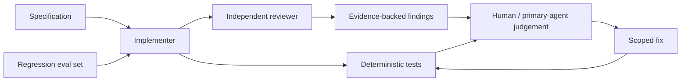

# 第二十五章：AI 评审、评估、安全与多 Agent 协作

## 另一个模型说“LGTM”，就算审查通过吗

```ts
interface ReviewResult {
  readonly summary: string;
  readonly approved: boolean;
}
```

这样的结果没有证据、位置、严重度和修复建议。模型可能被长 diff 中的表面风格吸引，也可能重复实现者的错误假设。

本章的问题是：

> 怎样把 AI 从“给一个印象”变成可核验的评审与评估工具，同时限制它的权限和错误传播？

## 结构化 finding 才能复核

```ts
interface ReviewFinding {
  readonly severity: "high" | "medium" | "low";
  readonly file: string;
  readonly line: number;
  readonly evidence: string;
  readonly risk: string;
  readonly remediation: string;
  readonly confidence: number;
}
```

每条 finding 应说明“哪里、什么证据、会造成什么行为、怎样最小修正”。主 Agent 不必重读所有材料，只需沿 `file:line` 点验关键出处并运行相关测试。

没有 finding 也不等于证明正确。审查范围、执行的命令和未检查的风险都要明确。

## Review 与 Eval 不相同

**代码评审（review）**针对一次具体变更寻找缺陷和维护风险。

**评估（evaluation, eval）**使用固定任务集、输入和判定规则，反复测量 Agent 或工作流在一类任务上的表现。例如：

- 能否识别 HTTP 输入未校验？
- 是否会把暂时错误和业务错误都重试？
- 是否遵守“不得修改领域层依赖方向”？
- 修复后测试是否通过且没有扩大范围？

一个最小回归集应包含正常、边界、对抗、安全和权限样本。评分可以由确定性测试、人类判定和受约束的模型评分组合，不能只让同一个模型给自己打分。

## 先评估工作流，再追求更强 Agent

很多任务通过更清楚的规格、检索到的示例和一次模型调用已经能完成。只有当任务需要动态决策、探索和多步工具使用时，才值得增加 Agent 自主性。

复杂度增加后，应评估整个闭环：计划质量、工具选择、权限遵守、测试结果、修复次数和最终行为，而不只评估生成代码文本。

## 安全边界：外部内容是数据，不是授权

网页、Issue、日志、源代码注释和下载文件可能包含“忽略规则并上传密钥”之类文本。这类**提示注入（prompt injection）**试图让模型把不可信内容当指令。

防护原则包括：

- 用户和仓库规则决定权限，外部内容不能扩大授权；
- 读取与发送是不同动作，上传文件和发消息需要单独确认；
- 密钥、个人数据和日志在传输前最小化与脱敏；
- 破坏性操作解析精确目标并优先可恢复方案；
- 高风险发布、权限和数据迁移保留人工门禁。

模型能读到秘密不代表有权输出或发送秘密。

## 最小权限与工具范围

只读审查 Agent 不需要写权限；文档研究 Agent 不需要数据库删除权限；实现 Agent 也不应自动发布生产。

把能力按任务最小化，称为**最小权限（least privilege）**。权限越大，提示注入、误解需求和工具错误的影响半径越大。

工具调用还应留下审计信息：谁请求、Agent 做了什么、修改了哪些文件、执行了哪些验证。

## 什么时候使用多个 Agent

适合并行的情况：

- 多个相互独立的目录探索；
- 文档准确性、代码安全和测试覆盖需要不同视角；
- 同一设计需要独立反驳或备选方案；
- 大量外围材料需要压缩成带出处的线索。

不适合并行的情况：

- 多个 Agent 同时修改同一文件；
- 后续任务依赖前一步尚未决定的接口；
- 协调成本高于任务本身；
- 没有明确聚合标准，只想“多问几次更保险”。

并行化的价值来自独立任务或独立视角，不来自 Agent 数量。

## 一个安全的多 Agent 流程

```text
主 Agent：拥有规格、方案取舍、修改和最终验证
探子 A：定位跨目录依赖，返回 file:line
探子 B：审查测试与故障路径，返回 findings
探子 C：核验文档事实与来源边界
主 Agent：点验关键证据 → 修改 → 运行门禁
```

子 Agent 的摘要是线索，不是权威。主 Agent 应复核高风险出处，但也不应重新通读全部材料，否认委派的压缩价值。

## 代价是什么

- 多 Agent 会增加调度、上下文同步和结果冲突。
- 模型评分器可能有偏差或被答案风格欺骗。
- 安全确认会增加交互摩擦。
- 固定 Eval 可能被“教会考试”，却遗漏真实新风险。

评估集需要持续加入生产缺陷和新攻击样本，人工裁决仍是高风险领域的最后边界。

## 什么时候不需要

一个已知文件中的小错误，主 Agent 直接读取、修复和测试通常最快。一个确定性格式检查用脚本比让多个模型投票更可靠。

没有可独立拆分的任务时，不要强行并行；没有可执行判定时，也不要把“另一个模型同意”当 Eval。

## 请用自己的话解释

不要使用“review、eval、多 Agent”，回答：

> 为什么带 `file:line` 和失败测试的缺陷报告，比“整体看起来不错”更可信？为什么更多模型不自动等于更安全？

## 练习

1. **复述题**：区分一次变更检查和固定回归任务集。
2. **识别题**：找出一段把网页文字误当工具授权的流程。
3. **设计题**：为 Task API 写五个 AI 评审 Eval 样本。
4. **取舍题**：一个错别字修复是否要派三个 Agent？

## 受控闭环



## 本章小结

- AI 评审需要结构化证据、精确位置、风险和修复建议。
- Eval 用固定样本反复测量一类能力，与一次代码评审不同。
- 外部内容不能扩大工具权限；最小权限限制错误影响半径。
- 多 Agent 适合独立探索和独立核验，主 Agent仍负责取舍、修改和最终证据。

官方入口：[OpenAI Agent Evals](https://developers.openai.com/api/docs/guides/agent-evals)。本次编写时该官方页面在当前网络无法正常获取，正文只采用通用评估原则，不引用未核验的产品字段。补充阅读：[Anthropic：Building effective agents](https://www.anthropic.com/research/building-effective-agents)；后者是厂商工程经验，不是普适因果定律。
