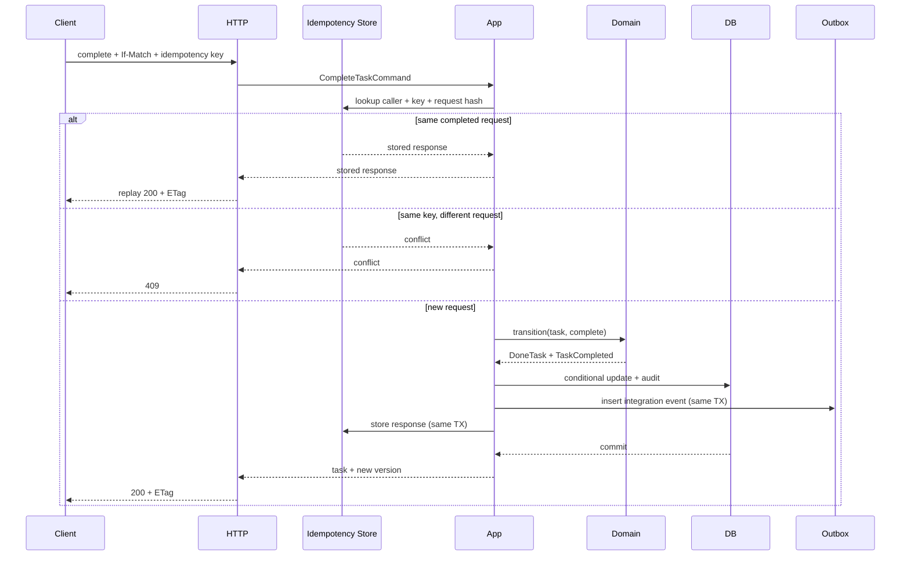

# 第二十六章：完整任务 API 架构复盘

## 先看最终问题，而不是最终目录

我们要设计一个可持续演进的任务管理 API。需求逐步增长为：

- 创建、查询、更新、完成和取消任务；
- 项目、负责人、子任务、依赖和评论；
- 状态迁移、并发编辑、审计和通知；
- 可分页查询、Webhook 和自动化；
- 可以测试、部署、观测和恢复。

本章不会假装教材示例已经实现全部功能。`examples/task-api` 目前只实现创建、列表、按 ID 查询和完成，仍是内存、单进程、无认证的可运行基线；更新、取消、项目、子任务、幂等、授权和事件能力都是下面讨论的演进目标。

## 系统边界与信任边界

```text
React / CLI / Integrations
        ↓ HTTPS + JSON
Task API modular monolith
        ↓ transactions
Owned relational database
        ↓ outbox events
Notification / Search / Webhook workers
```

外部客户端、Webhook、环境配置和数据库旧数据都属于运行时边界。身份认证发生在入口；授权需要结合租户、项目和任务所有权，不能只看“是否登录”。

## 领域模型先保护不变量

```ts
type TaskState =
  | { readonly status: "todo" }
  | { readonly status: "in_progress"; readonly startedAt: string }
  | { readonly status: "blocked"; readonly reason: string }
  | { readonly status: "done"; readonly completedAt: string }
  | { readonly status: "canceled"; readonly canceledAt: string };

interface Task {
  readonly id: string;
  readonly projectId: string;
  readonly title: string;
  readonly state: TaskState;
  readonly version: number;
}
```

联合类型让终态时间和状态一起出现。完整迁移至少明确：`todo → in_progress/canceled`、`in_progress → blocked/done/canceled`、`blocked → in_progress/canceled`；`done` 和 `canceled` 都是终态。重复完成或重复取消返回当前结果可以设计为幂等成功，而从 `done` 改为 `canceled` 必须拒绝。版本号用于乐观并发。

是否把子任务放进同一聚合，要看“父任务完成前所有子任务必须完成”是否要求强一致。如果子任务很多，可能改为独立聚合和最终一致的进度投影，避免每次加载整个树。

## 应用层按意图组织

写操作使用清晰命令：

```ts
interface CompleteTaskCommand {
  readonly taskId: string;
  readonly expectedVersion: number;
  readonly actorId: string;
  readonly idempotencyKey: string;
}
```

查询则返回适合 API 的投影，不必加载完整领域聚合：

```ts
interface ListTasksQuery {
  readonly projectId: string;
  readonly status?: Task["state"]["status"];
  readonly cursor?: string;
  readonly limit: number;
}
```

这种“写入表达意图、读取表达投影”的区分有 CQRS 思想，但不要求两个数据库或消息系统。只有读写模型确实独立扩展时，才进一步分离基础设施。

## HTTP 契约

| 方法与路径 | 目的 | 关键并发/错误 |
| --- | --- | --- |
| `POST /tasks` | 创建任务 | 幂等键、201/409 |
| `GET /tasks/:id` | 查询任务 | 404、ETag |
| `GET /tasks` | 筛选与 cursor 分页 | 稳定排序、最大 limit |
| `PATCH /tasks/:id` | 修改标题/负责人 | `If-Match`、409/412 |
| `POST /tasks/:id/complete` | 明确状态命令 | 非法迁移、幂等 |
| `POST /tasks/:id/cancel` | 取消任务 | 权限、非法迁移 |

不把所有行为塞进一个任意 `status` PATCH，是为了让每个业务意图拥有独立授权、审计和状态规则。

统一错误结构：

```ts
interface ApiError {
  readonly code: string;
  readonly message: string;
  readonly details?: Readonly<Record<string, unknown>>;
  readonly requestId: string;
}
```

`code` 稳定供程序判断，`message` 供人阅读；内部堆栈、SQL 和密钥不能越过 HTTP 边界。

## 模块与依赖方向

```text
tasks/domain          任务不变量和状态迁移
tasks/application     命令、查询、事务与端口
tasks/http            JSON Schema、认证上下文、错误映射
tasks/infrastructure  SQL Repository、Outbox、外部客户端
composition           配置、连接、生命周期和接线
```

模块按任务领域所有权组织，在模块内部再区分必要的技术边界。通知、身份和搜索发展为独立业务能力后，可以拥有自己的模块与表；先保持模块化单体，不急于拆网络服务。

## 一次完成请求的完整流

1. HTTP 入口解析 JSON、身份、`If-Match` 和幂等键。
2. 应用用例按“调用者 + 幂等键”查询记录：同请求直接重放原响应，同键不同摘要返回 409。
3. 新请求检查权限并加载任务。
4. 领域函数验证状态迁移，生成新版本和领域事件。
5. 同一数据库事务条件更新任务、写审计、Outbox 和幂等结果。
6. 提交后返回新 ETag；并发重复请求重放相同结果。
7. 发布器读取 Outbox，发送版本化集成事件。
8. 通知与搜索消费者按事件 ID 幂等处理。



## 数据与查询

核心表至少包含 `tasks`、`idempotency_records`、`audit_entries` 和 `outbox_events`。外键、唯一约束和检查约束是最后一道防线，但不能代替领域错误信息。

任务列表索引按真实访问模式设计，例如 `(tenant_id, project_id, status, created_at DESC, id DESC)`。字段顺序应通过查询计划验证，不复制示例即用。

迁移采用 expand/backfill/contract，使新旧应用版本可以短暂共存。删除状态值或改变事件含义必须经过版本迁移，而不是直接更新枚举。

## 可靠性与安全

- 所有外部调用有总超时预算和取消。
- 只重试暂时错误；写操作先证明幂等。
- 幂等键按调用者作用域唯一，并绑定请求摘要。
- Webhook 使用签名、时间戳、重放窗口、速率限制和投递记录。
- 授权在租户→项目→任务范围逐层判断。
- 密钥由部署环境提供，不进入日志、代码或镜像。
- 审计记录与普通调试日志分离，并定义写入失败策略。

长时间导出或批量自动化返回 `202 Accepted` 和 Job ID，客户端查询状态或接收签名 Webhook；不要让一个 HTTP 连接等待几十分钟。

## 测试策略

- 领域：状态迁移、不变量、重复完成。
- 应用：权限、事务协调、幂等、版本冲突。
- Repository：真实数据库契约、隔离和迁移。
- HTTP：Schema、状态码、错误结构、ETag。
- 事件：Outbox、重复、乱序、旧版本。
- 端到端：创建→完成→查询→审计的关键路径。
- 恢复演练：备份还原、失败迁移、发布回退。

AI 评估集可以把以下内容写成固定样本和确定性断言：领域是否 import 框架、写请求是否无条件重试、事件与数据库是否可能不一致、日志是否泄密、迁移是否允许新旧版本共存。一次具体代码评审仍应输出带 `file:line` 的 finding。

## 可观测性与发布

每个请求生成 `requestId` 和 trace；日志记录稳定错误码、任务 ID、版本和耗时；指标关注请求率、错误率、延迟、数据库连接、Outbox 积压和业务完成成功率。

构建生成不可变产物，Canary 同时观察技术指标和核心业务指标。Schema 变更先扩展，代码回退前验证旧版本仍能读取新 Schema。备份定期恢复演练并记录 RPO/RTO。

## 何时才拆微服务

通知或搜索只有在以下证据出现时才独立部署：团队需要独立发布、负载或故障隔离明显不同、领域边界稳定，并且已有自动部署、追踪和消息幂等能力。

在此之前，模块化单体能用本地事务和直接调试更快验证业务。代码模块清晰不是将来拆分的保证，却提供了更低风险的起点。

## 代价与明确非目标

完整设计增加了 Schema、事务、事件、遥测和运维成本。不是每个任务工具都需要全部能力。

对于当前教材示例，明确不实现：PATCH 更新、取消、项目/子任务、幂等记录、认证、多租户、SQLite/PostgreSQL、Outbox、Webhook、React 客户端和云部署。它的目标是证明依赖方向和测试边界；本章给出的是规模增长后的决策地图，而不是谎称已完成的功能清单。

## 什么时候不需要继续扩展

个人或小团队工具只需创建、查询和完成任务，进程重启丢数据也可接受时，当前内存 Task API 已经能教学和实验。先运行测试、修改规则、观察边界，再决定加入数据库。

只有当数据持久性、并发协作、审计或外部集成成为真实需求时，才逐项引入对应机制。

## 请用自己的话解释

不要使用本课程的架构术语，回答：

> 一次完成任务请求，哪些决定属于任务规则，哪些属于 HTTP，哪些属于数据库一致性，哪些属于运行和恢复？

## 综合练习

1. 画出创建任务的 command、query 和 event 三条流。
2. 为 `PATCH /tasks/:id` 定义并发冲突、幂等和审计行为。
3. 写越权、重复投递和乱序事件测试矩阵。
4. 选择是否把通知拆成服务，并用五条当前证据说明。
5. 对照 [可运行示例](../../examples/task-api/README.md)，列出从内存版到数据库版最小的下一步，不一次加入全部机制。

## 全课程最终小结

软件架构不是把代码分进流行目录，而是持续回答：

```text
什么正在变化
→ 谁拥有这个决定
→ 依赖应该指向哪里
→ 失败会停在哪里
→ 用什么证据证明它
→ 复杂度是否值得
```

原则、模式、DDD、微服务、可观测性和 AI 工作流都是这组问题在不同尺度上的工具。先看见真实压力，再选择最小边界，并用测试和运行证据不断修正，这比记住任何一张终极架构图更可靠。
